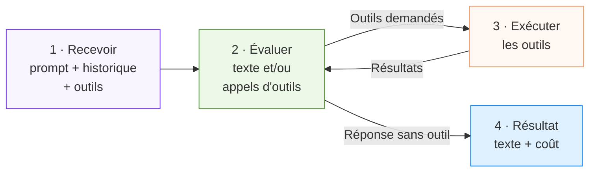
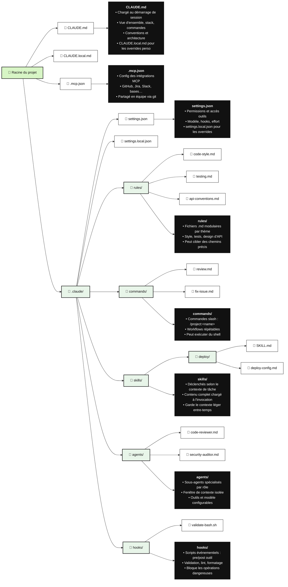

Ce guide couvre la **mise en pratique avec Claude Code et l'Agent SDK** : boucle d'exécution, configuration du dépôt, automations, hooks et contrôles de production.

---

## La boucle d'exécution (sous le capot)

Claude Code et l'**Agent SDK** partagent le même moteur : vous envoyez un prompt, l'agent évalue, agit via des outils, intègre les résultats, et recommence. Votre boucle produit (automation, `/loop`, cron) enchaîne plusieurs de ces sessions ; à l'intérieur de chacune, c'est toujours le même cycle.



### Tours et messages

Un **tour** = un aller-retour complet dans la boucle : Claude produit des appels d'outils, le SDK les exécute, les résultats reviennent automatiquement — **sans** rendre la main à votre code. Les tours s'enchaînent jusqu'à une réponse sans appel d'outil.

Exemple pour « Corriger les tests en échec dans auth.ts » :

| Tour | Ce qui se passe |
|---|---|
| 1 | `Bash` lance `npm test` → 3 échecs |
| 2 | `Read` sur `auth.ts` et `auth.test.ts` |
| 3 | `Edit` corrige `auth.ts`, puis `Bash` relance les tests → OK |
| Final | Réponse texte seule : « Bug corrigé, les 3 tests passent. » |

Une question simple (« quels fichiers ici ? ») tient en 1–2 tours. Un refactor peut en enchaîner des dizaines.

**SDK** (Agent SDK) — Package autonome (`claude_agent_sdk` en Python, `@anthropic-ai/claude-agent-sdk` en TypeScript) qui embarque la boucle de Claude Code dans vos propres apps : outils, permissions, limites de coût, hooks. Pas besoin du CLI installé.

### Limiter la boucle interne

Sans plafond, l'agent tourne jusqu'à ce qu'il estime avoir fini — acceptable pour une tâche bornée, risqué pour « améliore ce codebase ».

| Option SDK | Rôle | Équivalent boucle produit |
|---|---|---|
| `max_turns` / `maxTurns` | Plafond de tours avec outils | Nombre max d'itérations |
| `max_budget_usd` / `maxBudgetUsd` | Plafond de dépense | Budget tokens / coût |

Quand une limite est atteinte, le SDK renvoie un `ResultMessage` — vérifiez toujours `subtype` avant de lire `result` :

| `subtype` | Signification | `result` disponible ? |
|---|---|---|
| `success` | Tâche terminée normalement | Oui |
| `error_max_turns` | Plafond de tours atteint | Non — reprendre via `session_id` |
| `error_max_budget_usd` | Plafond de budget atteint | Non |
| `error_during_execution` | Erreur API ou annulation | Non |

### Outils intégrés

Sans outils, Claude ne peut que répondre en texte. Avec outils, il lit, modifie, exécute, cherche :

| Catégorie | Outils | Usage |
|---|---|---|
| Fichiers | Read, Edit, Write | Lire, modifier, créer |
| Recherche | Glob, Grep | Trouver fichiers et contenu |
| Exécution | Bash | Commandes, scripts, git |
| Web | WebSearch, WebFetch | Recherche et fetch de pages |
| Orchestration | Agent, Skill, TaskCreate… | Sous-agents, skills, suivi de tâches |

Les outils en lecture seule (Read, Glob, Grep) peuvent s'exécuter **en parallèle** ; Edit, Write et Bash passent en **séquentiel** pour éviter les conflits.

### Permissions : ce qui tourne vraiment en autonome

Trois leviers combinés :

| Levier | Effet |
|---|---|
| `allowed_tools` | Auto-approuve les outils listés (ex. `["Read", "Glob", "Grep"]` pour un agent lecture seule) |
| `disallowed_tools` | Bloque des outils, quelle que soit la config |
| `permission_mode` | Comportement par défaut pour le reste |

Modes utiles pour les boucles :

| Mode | Comportement |
|---|---|
| `default` | Demande approbation via callback — bon pour une UI interactive |
| `acceptEdits` | Auto-approuve les edits fichiers et commandes fs courantes ; Bash reste filtré |
| `dontAsk` | Ne demande jamais : outils pré-approuvés seulement, le reste est refusé |
| `bypassPermissions` | Tout passe — **uniquement** en CI, conteneur ou environnement isolé |

Quand un outil est refusé, Claude reçoit un message de rejet et tente une autre approche.

### Contexte, compaction et hooks

Le **contexte ne se réinitialise pas entre les tours** d'une même session : prompt système, définitions d'outils, historique, entrées/sorties d'outils — tout s'accumule. Les gros fichiers lus ou les logs verbeux peuvent consommer des milliers de tokens en un tour.

| Source | Impact |
|---|---|
| `CLAUDE.md` / skills | Rechargés à chaque requête (mis en cache après le premier appel) |
| Historique de conversation | Croît à chaque tour |
| Sorties d'outils volumineuses | Principal facteur de dérive sur longues sessions |

Quand la fenêtre de contexte approche sa limite, le SDK **compacte** : résume l'historique ancien et émet un événement `compact_boundary`. Les instructions persistantes appartiennent dans `CLAUDE.md` ou un skill — pas seulement dans le prompt initial, qui peut disparaître à la compaction.

**Hooks** (callbacks hors contexte, donc sans coût tokens) :

| Hook | Moment | Usage typique en boucle |
|---|---|---|
| PreToolUse | Avant exécution | Bloquer une commande dangereuse |
| PostToolUse | Après retour | Auditer, déclencher un side-effect |
| Stop | Fin de session | Valider le résultat, écrire `STATE.md` |
| PreCompact | Avant compaction | Archiver le transcript complet |
| SubagentStart / Stop | Sous-agent | Agréger des résultats parallèles |

**Garder le contexte léger** : sous-agents pour les sous-tâches (contexte frais, seul le résumé remonte), outils au strict nécessaire, `effort: "low"` pour les tâches simples (listings, grep).

**Exemple SDK minimal** (Python) — agent autonome avec limites et outils pré-approuvés :

```python
from claude_agent_sdk import query, ClaudeAgentOptions, ResultMessage

async for message in query(
    prompt="Corriger les tests en échec dans le module auth",
    options=ClaudeAgentOptions(
        allowed_tools=["Read", "Edit", "Bash", "Glob", "Grep"],
        setting_sources=["project"],  # CLAUDE.md, skills, hooks
        max_turns=30,
        effort="high",
    ),
):
    if isinstance(message, ResultMessage):
        if message.subtype == "success":
            print(message.result)
        elif message.subtype == "error_max_turns":
            print(f"Limite de tours — reprendre session {message.session_id}")
```

---

## Configuration du dépôt Claude Code

Une boucle durable s'appuie sur des **fichiers versionnés** dans le dépôt. Voici l'arborescence typique :



Les fichiers `.local` et `settings.local.json` restent hors git (overrides personnels). Le reste est versionné et alimente chaque run de la boucle.

### Prompt, projet ou skill ?

Trois niveaux de persistance — du plus éphémère au plus structuré. Une boucle mature combine **projet** (`CLAUDE.md` + `.claude/`) + **skills** (processus répétitifs) ; le prompt seul ne suffit pas.

| Critère | Prompt | Projet (`CLAUDE.md` + `.claude/`) | Skills |
|---|---|---|---|
| **Idée générale** | Instructions données à chaque conversation. | Espace projet avec fichiers et instructions persistantes. | Processus enseigné une fois, réutilisable automatiquement. |
| **Où ça vit** | Dans le chat ou la session courante. | Dans le dépôt : `CLAUDE.md`, `.claude/`, versionné. | `.claude/skills/<nom>/SKILL.md`, chargé à la demande. |
| **Mise en place** | Aucune — vous tapez directement. | ~5 min : créer les fichiers projet de base. | ~15 min : rédiger la skill, tester, committer. |
| **Mémoire / contexte** | Rien ne persiste entre les sessions. | Instructions et fichiers relus à chaque requête (mis en cache). | Description courte toujours visible ; contenu complet à l'invocation. |
| **Automatisation** | Non — vous répétez les consignes. | Non — il faut lancer la session dans le bon dépôt. | Oui — Claude reconnaît la tâche et invoque la skill. |
| **Workflow** | Vous redonnez les étapes à chaque fois. | Étapes stockées dans `CLAUDE.md`, `rules/` ou `commands/`. | Workflow intégré étape par étape dans la skill. |
| **Qualité de sortie** | Variable, dépend du prompt du moment. | Plus constante — contexte projet stable. | Très constante sur les tâches répétitives. |
| **Économie de tokens** | Faible — longs prompts à chaque fois. | Moyenne — vous évitez de tout répéter. | Bonne — seul le nécessaire est chargé. |
| **Meilleur usage** | Tâches rapides, ponctuelles. | Sessions longues, style, architecture, mémoire projet. | Processus structurés que vous refaites souvent (triage CI, deploy, review). |
| **Image mentale** | Expliquer chaque matin votre travail à un inconnu. | Donner un classeur d'onboarding à un nouvel employé. | Former un employé une fois pour qu'il applique toujours le processus. |
| **Dans une boucle** | Suffit pour un run manuel ponctuel. | Socle obligatoire — état + spec + permissions. | Cœur du run automatisé — c'est la skill qui encode le processus. |

Pour une boucle viable : `CLAUDE.md` pour le socle, une skill pour le workflow, `STATE.md` pour l'état, hooks `Stop` pour persister entre les runs.

---

## Automations Claude : `/loop` et `/goal`

Les automations transforment une exécution unique en **vraie boucle**. Avec Claude Code :

| Mécanisme | Usage |
|---|---|
| `/loop` | Relance sur une cadence en session |
| `/goal` | Continue jusqu'à ce qu'une condition soit vraie (vérifiée par un modèle indépendant) |
| Tâches planifiées Desktop | Runs récurrents hors session active |
| Routines cloud | Automations hébergées |
| Hooks | `Stop` → écrire l'état, `PreToolUse` → bloquer une commande |

Deux primitives à distinguer :

- **`/loop`** — relance sur une cadence. Pour des vérifications régulières, quel que soit l'état.
- **`/goal`** — continue jusqu'à ce qu'une condition écrite soit **vraiment** vraie. Un petit modèle séparé vérifie la complétion : celui qui a écrit le code ne le note pas.

**Exemple concret :**

```
> /loop 30m /goal Tous les tests dans test/auth passent et le lint est propre.
  Scanner src/auth pour les nouveaux échecs, proposer des correctifs dans claude/auth-fixes,
  ouvrir une PR brouillon quand la condition /goal est remplie.

▲ Claude
  CronCreate(*/30 * * * * : boucle qualité auth)
  Condition d'arrêt : tests OK + lint propre (vérifié par un contrôleur indépendant)
✓ Planifié. Continue au-delà des complétions intermédiaires
  jusqu'à ce que la condition /goal soit atteinte par le vérificateur.
```

---

## Worktrees avec Claude Code

| Mécanisme | Usage |
|---|---|
| `git worktree` | Checkout séparé manuel |
| `--worktree` | Flag CLI pour isoler la session |
| `isolation: worktree` | Option sur un sous-agent — checkout éphémère auto-nettoyé |

Les worktrees éliminent les collisions mécaniques entre agents parallèles. Votre bande passante de revue fixe le plafond du parallélisme réel.

---

## Skills Claude

Un **Skill** vit dans `.claude/skills/<nom>/SKILL.md`. Sans skills ni `CLAUDE.md`, chaque cycle redérive tout le contexte depuis zéro — et la compaction peut effacer les instructions données uniquement dans le chat.

**Exemple complet — triage CI :**

```
name: ci-triage
description: Classifier les échecs CI par cause (env, flake, bug réel,
  dépendance, infra), brouillonner les correctifs simples, escalader le reste.
  Déclenché à chaque échec de workflow ou lors de la boucle de triage matinale.
---

# Skill CI triage

## Règles de classification
- env : secret manquant, mauvaise variable, infra non provisionnée → humain
- flake : passe au retry sans changement de code → retry une fois, puis dossier
- bug : échec déterministe lié à un commit récent → brouillon de correctif
- dependency : échec lié à un bump de version → brouillon de rollback
- infra : timeout, OOM, problème de runner → escalade

## Patterns de correctif
- Tests auth → vérifier src/auth/middleware en premier
- Tests base de données → vérifier que la migration est appliquée en CI
- Tests E2E → vérifier les sélecteurs contre le dernier snapshot UI

## Interdits
- Désactiver des tests en échec — toujours escalader
- Modifier la config CI sans approbation humaine
- Toucher src/payments/ ou src/billing/ (voir claude/permissions.md)

## État
Mettre à jour STATE.md après chaque run : fichiers vérifiés, classifications,
PR ouvertes, éléments escaladés.
```

---

## Connecteurs MCP

Configurez les serveurs dans `.mcp.json` à la racine du dépôt. Chaque serveur MCP ajoute des schémas d'outils au contexte — limitez le nombre de serveurs et d'outils exposés.

**Connecteurs les plus rentables pour les boucles Claude :**

| Connecteur | Usage typique |
|---|---|
| **GitHub** | Lire les dépôts, créer des branches, ouvrir des PR, commenter, réagir aux webhooks |
| **Linear / Jira** | Mettre à jour les tickets, lier les PR, fermer automatiquement quand la vérif passe |
| **Slack** | Poster les résultats de triage, alerter sur les escalades, résumer les runs nocturnes |
| **Sentry** | Investiguer les alertes live, brouillonner des correctifs pour les erreurs fréquentes |

---

## Sous-agents Claude

Sous-agents dans `.claude/agents/` ou via l'outil `Agent`. Chaque sous-agent démarre avec un **contexte frais** : pas l'historique du parent, seul son résumé final remonte.

**Répartition habituelle** : un explore, un implémente, un vérifie contre la spec.

Dans une boucle non surveillée, un vérificateur de confiance est la seule raison de pouvoir s'éloigner. Les sous-agents consomment plus de tokens — dépensez-les là où un second avis vaut le coût, pas pour du travail que `Glob` + `Grep` suffisent à faire.

---

## Fichier d'état et reprise de session

L'agent oublie. Le fichier, non. Sauvegardez aussi le `session_id` du SDK pour reprendre une session interrompue par `error_max_turns`.

**Exemple `STATE.md` :**

```
# État de boucle · ci-triage

## Dernier run
2026-06-09 03:30 UTC · 7 échecs classifiés, 3 correctifs brouillonnés, 4 escaladés

## En cours
- claude/fix-auth-token-refresh — tests OK en local, en attente CI
- claude/fix-flaky-payment-webhook — pattern de retry appliqué, surveillance

## Terminé aujourd'hui
- claude/bump-axios-1.7.4 → mergé (CI verte, boucle deps vérifiée)
- claude/lint-fix-pass-june-9 → mergé

## Escaladé aux humains
- src/billing/refund.ts — tests en échec de 3 façons, cause racine floue
- ci/staging-runner — timeouts infra, pas un problème de code

## Leçons apprises (écrire ici, pas dans le chat)
- 2026-06-08 : PowerShell pose un souci TLS 1.2 sur ce runner Windows. Utiliser bash.
- 2026-06-07 : tests/e2e/checkout exige le secret webhook Stripe en env. Ignorer si absent.

## Conditions d'arrêt atteintes depuis la dernière revue
- /goal « tous les tests passent + lint propre » atteint au commit 3a7b8c1 à 02:14 UTC
```

Associez un hook `Stop` pour écrire `STATE.md` automatiquement à la fin de chaque run.

---

## Contrôles SDK pour la production

| Paramètre | Valeur indicative | Pourquoi |
|---|---|---|
| `max_turns` | 20–50 selon la tâche | Évite les sessions qui partent en vrille |
| `max_budget_usd` | plafond par run | Facture prévisible |
| `allowed_tools` | liste minimale | Moins de surface d'attaque, moins de contexte |
| `permission_mode` | `acceptEdits` (dev) / `dontAsk` + allow list (CI) | Autonomie sans tout ouvrir |
| `effort` | `low` pour triage, `high` pour debug | Coût/latence vs profondeur de raisonnement |
| Hook `Stop` | écrire `STATE.md` | État toujours à jour entre les runs |

**L'ordre compte** : run manuel fiable → skill → boucle → planification. Sauter des étapes, c'est payer pour un système que personne ne comprend.

---

## Coûts, tokens et modèles

Les boucles consomment des tokens à chaque tour : prompt système, `CLAUDE.md`, définitions d'outils, historique, sorties d'outils volumineuses. Ce n'est pas une dépense unique — c'est un **flux récurrent**.

### Ce qui coûte le plus

| Poste | Pourquoi | Levier |
|---|---|---|
| Tours nombreux | Chaque tour recharge le contexte accumulé | `max_turns`, tâches bornées, sous-agents pour isoler |
| Sorties d'outils lourdes | `Read` d'un gros fichier, `Bash` verbeux | Limiter la lecture, filtrer les logs, `Grep` avant `Read` |
| Sous-agents | Chaque agent = sa propre session + modèle | Réserver aux vérifications et tâches complexes |
| MCP excessif | Schémas d'outils dans chaque requête | Peu de serveurs, ToolSearch si disponible |
| Effort élevé | Plus de raisonnement par tour | `effort: "low"` pour triage, `"high"` pour debug seulement |
| Retries sans porte | L'agent explore en boucle sans livrer | Porte objective + `max_budget_usd` |

### Comment monitorer

| Source | Ce qu'elle donne |
|---|---|
| `ResultMessage.total_cost_usd` (SDK) | Coût par session, même en cas d'erreur |
| `ResultMessage.usage` | Détail input/output/cache par run |
| Métrique **coût / changement accepté** | Le seul indicateur business utile — pas les tokens tentés |
| Dashboard Anthropic / facturation forfait | Vue globale hors SDK |
| `STATE.md` | Journaliser coût et tours par run de boucle |

Plafonds recommandés : `max_budget_usd` par run, `max_turns` par session, budget mensuel par équipe, alerte si le taux d'acceptation tombe sous 50 %.

**Prompt caching** — Le contenu stable (`CLAUDE.md`, définitions d'outils inchangées) est mis en cache par l'API : le premier appel paie plein tarif, les suivants sont nettement moins chers. Un `CLAUDE.md` bien structuré et stable amortit vite ses tokens.

### Ollama, modèles locaux et Claude

**Non, on ne branche pas Ollama sur Claude Code comme moteur de remplacement.** Claude Code et l'Agent SDK appellent les modèles **Anthropic** (Claude) via l'API officielle. Ollama sert à exécuter des modèles open source **en local** (Llama, Mistral, Qwen…) via une API compatible OpenAI — c'est une stack parallèle, pas un plugin Claude.

| Approche | Rôle dans une architecture de boucle |
|---|---|
| **Claude Code / SDK** | Agent principal : édition, outils, boucle complète |
| **Ollama (local)** | Tâches cheap en marge : classification, résumé, pré-filtrage avant d'appeler Claude |
| **Modèle léger Anthropic (Haiku)** | Vérificateur `/goal`, checker indépendant — même écosystème, moins cher |
| **LiteLLM / proxy custom** | Routage multi-fournisseurs côté infra — hors scope Claude Code natif ; à réserver aux intégrations maison |

Stratégie pragmatique pour réduire la facture sans sacrifier la qualité :

1. **Haiku** (ou effort `low`) pour le contrôleur ; **Sonnet/Opus** pour le faiseur.
2. **Sous-agents** uniquement quand un second avis vaut le coût.
3. **`max_budget_usd`** et **`max_turns`** sur chaque automation.
4. **Skills** au lieu de prompts longs — charge ciblée.
5. **Ollama en amont** (optionnel) pour trier, résumer ou classer avant d'envoyer le reste à Claude — utile sur gros volumes, pas comme substitut à la boucle d'édition.

Un proxy non officiel vers Ollama à la place de l'API Anthropic n'est pas supporté par Claude Code. Pour du 100 % local, utilisez des outils conçus pour (Continue, Aider, OpenCode…) — avec d'autres compromis qualité/outils.

---

## Conclusion

Avec Claude Code et l'Agent SDK, la boucle d'exécution (tours d'outils, compaction, hooks) est le moteur ; `/loop`, `/goal`, skills et `STATE.md` en sont l'orchestration.

Construisez petit : `CLAUDE.md` + une skill + `STATE.md` + une porte objective. Plafonnez chaque run (`max_budget_usd`, `max_turns`), et gardez le contexte léger.

Pour le cadre conceptuel complet, voir [loop-theorie.md](loop-theorie.md).
