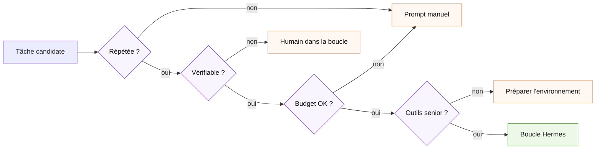
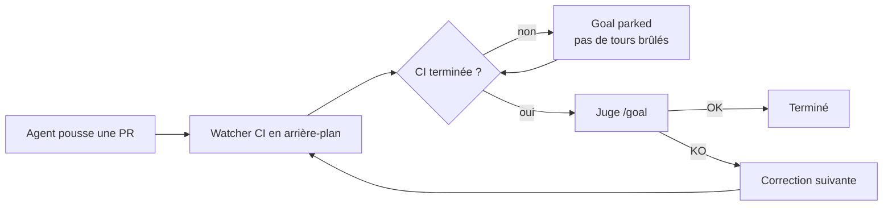
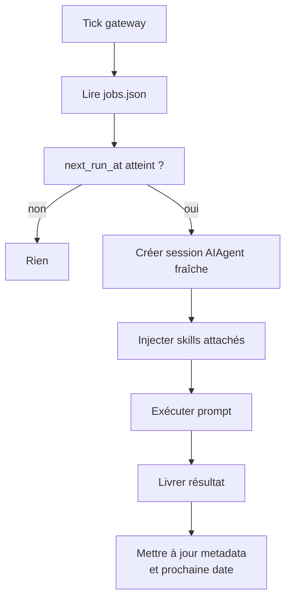
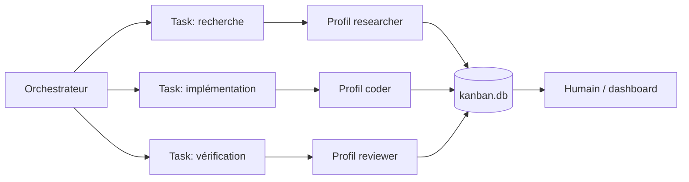
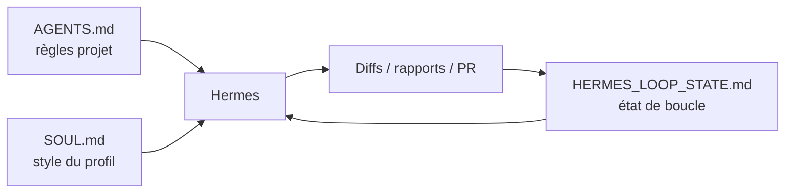

Ce guide couvre la **mise en pratique des boucles avec Hermes Agent** : `/goal`, cron, kanban, profils, skills, mémoire, worktrees, intégrations et garde-fous.

La différence importante : Hermes n'est pas seulement un agent qui exécute des prompts. C'est un agent pensé autour d'une **boucle d'apprentissage et de persistance** : il peut créer des skills depuis l'expérience, améliorer ces skills, se souvenir de faits utiles, rechercher ses anciennes sessions, planifier des tâches, déléguer à d'autres profils et continuer un objectif au-delà d'un seul tour.

**Version honnête** : Hermes est très puissant pour construire des boucles, mais il pousse facilement à l'illusion dangereuse du “laisse tourner”. La bonne approche n'est pas de lancer plus d'autonomie ; c'est de rendre la boucle **plus petite, plus vérifiable et plus bornée**.

---

## La boucle Hermes en une image

Hermes combine trois niveaux qui sont souvent confondus :

| Niveau | Question | Primitive Hermes | Risque principal |
|---|---|---|---|
| **Boucle d'exécution** | Comment l'agent agit-il pendant une session ? | `AIAgent`, outils, terminal, fichiers, navigateur, mémoire, skills | Contexte qui gonfle, outils trop larges |
| **Boucle d'objectif** | Comment l'agent continue-t-il sans “continue” manuel ? | `/goal`, juge auxiliaire, contrats, `/subgoal`, attente sur processus | Objectif vague, faux positif du juge |
| **Boucle produit** | Comment relancer, distribuer et historiser le travail ? | `cron`, `kanban`, profils, dashboard, gateway, webhooks | Coût récurrent, sécurité, dérive d'état |

```mermaid
flowchart LR
    U[Vous fixez<br/>un objectif] --> G[/goal<br/>objectif persistant]
    G --> A[AIAgent<br/>session Hermes]
    A --> T[Outils<br/>terminal · fichiers · web · navigateur]
    T --> A
    A --> J[Juge léger<br/>done / continue / wait]
    J -- continue --> A
    J -- done --> R[Résultat]
    J -- wait --> W[Attente<br/>CI · build · process]
    W --> J

    A -. apprend .-> M[Memory<br/>faits]
    A -. formalise .-> S[Skills<br/>procédures]
    C[Cron] -. relance .-> A
    K[Kanban] -. distribue .-> A

    classDef core fill:#edf8e8,stroke:#5b9b45,color:#111;
    classDef loop fill:#f8f5ff,stroke:#7c3aed,color:#111;
    classDef tool fill:#fff7f2,stroke:#f0a06f,color:#111;
    classDef state fill:#dff1ff,stroke:#0787ff,color:#111;

    class A,J core;
    class G,C,K loop;
    class T tool;
    class M,S,W,R state;
```

**Point clé** : avec Hermes, la boucle la plus rentable n'est pas forcément un script externe. Elle peut être composée directement avec `/goal`, `cron`, `kanban`, `skills`, `profiles`, `AGENTS.md`, `SOUL.md` et un fichier d'état dans le dépôt.

---

## État du repo au 25 juin 2026 : ce qui change pour les boucles

Les derniers commits du dépôt `NousResearch/hermes-agent` montrent une direction très claire : Hermes se durcit autour de la **continuité**, de la **vérification** et du **coût**.

| Axe récent | Ce que les pushes indiquent | Impact sur les boucles |
|---|---|---|
| **Cache / coût** | `prompt_cache_key` adressé par contenu pour que les cron récurrents réutilisent mieux le préfixe chaud | Les jobs planifiés deviennent moins gaspilleurs si leur contexte reste stable |
| **Vérification avant arrêt** | ledger d'évidence, statut de vérification exposé, reconnaissance des scripts de vérification ad hoc, exigence de vérification avant fin d'édition | Hermes se rapproche d'une vraie “porte” au lieu d'une auto-déclaration de succès |
| **Cron continuable** | livraison miroir dans la conversation cible, thread préféré, scope par conversation d'origine, alternance sûre | Les automations deviennent plus faciles à suivre dans les canaux réels |
| **Gateway / cloud** | mode dormant / scale-to-zero | Meilleure compatibilité avec les agents persistants qui dorment entre deux runs |
| **Sécurité** | autorisation relay par livraison, assainissement de cwd Docker, redaction par défaut dans les releases récentes | Les boucles non surveillées restent dangereuses, mais les garde-fous progressent |

**Lecture critique** : le signal le plus intéressant n'est pas “Hermes a plus de features”. C'est que les features récentes visent les trois faiblesses structurelles des boucles : **elles coûtent**, **elles s'arrêtent trop tôt**, **elles perdent leur continuité**.

---

## PARTIE 1 · Quand utiliser une boucle Hermes

### 01. Le test des 4 conditions reste obligatoire

Avant de transformer une tâche en boucle Hermes, vérifiez les quatre conditions suivantes :

| # | Condition | Question de décision | Sinon |
|---|---|---|---|
| 1 | **Répétition** | La tâche revient-elle au moins chaque semaine ? | Prompt manuel |
| 2 | **Vérification automatique** | Existe-t-il une commande qui peut dire non ? | Revue humaine |
| 3 | **Budget absorbable** | Les retries inutiles sont-ils acceptables ? | Boucle trop chère |
| 4 | **Outils suffisants** | Hermes a-t-il logs, shell, fichiers, web, repo, tests ? | Boucle aveugle |



Hermes rend l'autonomie facile. C'est précisément pour cela que le test est encore plus important qu'avec un agent manuel.

### 02. Les meilleures premières boucles Hermes

| Boucle | Primitive Hermes | Porte objective | Pourquoi c'est bon |
|---|---|---|---|
| Triage CI quotidien | `cron` + skill `ci-triage` | `scripts/run_tests.sh`, statut CI | Répétitif, borné, automatisable |
| Nettoyage lint | `/goal` ou `cron` | `ruff`, `eslint`, `mypy`, `pytest` | L'agent peut corriger puis prouver |
| Revue PR assistée | skill + GitHub/MCP | tests + checklist review | Hermes peut résumer, pas merger seul |
| Veille repo / issues | `cron` + livraison Telegram/Slack | pas de modification code | Faible risque, forte valeur |
| Décomposition multi-tâches | `kanban` + profils | revue par étape | Durable et observable |
| Rapport hebdo projet | `cron` + `context_from` | fichier généré | Bon usage du chaînage |

### 03. Les mauvaises premières boucles

| Mauvaise boucle | Pourquoi |
|---|---|
| “Refactorise toute l'architecture” | Succès non objectivable ; dette de compréhension massive |
| “Améliore le produit” | Objectif flou, juge faible, scope infini |
| “Corrige l'auth et déploie” | Surface sécurité + irréversibilité |
| “Mets à jour toutes les dépendances et merge” | Trop de risques transverses |
| “Surveille tout et fais ce qu'il faut” | Permissions trop larges, coût non borné |

**Règle simple** : Hermes peut travailler longtemps ; cela ne veut pas dire qu'il doit décider longtemps.

---

## PARTIE 2 · Les primitives Hermes

## `/goal` : la boucle d'objectif persistante

`/goal` donne à Hermes un objectif durable. Après chaque tour, un juge léger regarde la dernière réponse et décide : **done**, **continue** ou **wait**. Si ce n'est pas fini, Hermes se reprompte lui-même dans la même session.

### Quand utiliser `/goal`

Bon usage :

```text
/goal Corriger tous les tests du module auth
verify: uv run pytest tests/auth && uv run ruff check src/auth tests/auth
constraints: ne pas changer le format de réponse de /login
boundaries: src/auth, tests/auth
stop when: une migration DB ou une décision produit est nécessaire
```

Mauvais usage :

```text
/goal Améliore le backend autant que possible
```

Le premier donne au juge une surface de preuve. Le second l'invite à halluciner une définition de “mieux”.

### Contrat de complétion

Un `/goal` solide doit contenir cinq champs mentaux :

| Champ | Question |
|---|---|
| `outcome` | Quel état final unique doit être vrai ? |
| `verification` | Quelle commande ou quel artefact le prouve ? |
| `constraints` | Qu'est-ce qui ne doit pas régresser ? |
| `boundaries` | Quels fichiers / outils / systèmes sont dans le scope ? |
| `stop_when` | À quel moment Hermes doit arrêter et demander ? |

```mermaid
flowchart LR
    O[Outcome] --> V[Verification]
    V --> C[Constraints]
    C --> B[Boundaries]
    B --> S[Stop when]
    S --> G[/goal robuste]

    classDef box fill:#fff,stroke:#222,color:#111;
    classDef final fill:#111,stroke:#111,color:#e8a317;
    class O,V,C,B,S box;
    class G final;
```

### `/subgoal` : resserrer une boucle en cours

Quand un objectif est déjà actif, `/subgoal` permet d'ajouter un critère sans repartir de zéro.

Exemple :

```text
/subgoal ajoute un test de régression couvrant le bug corrigé
```

C'est utile quand Hermes corrige le symptôme mais oublie de verrouiller la non-régression.

### `/goal wait` : ne pas brûler du budget en attendant

Certaines boucles sont bloquées par un processus externe : CI, build long, watcher, déploiement de staging. Hermes peut parquer l'objectif sur un process ou une attente. La bonne forme mentale :



**Erreur à éviter** : demander à Hermes de “checker toutes les minutes” dans une boucle LLM. Si un script ou un watcher peut attendre sans modèle, utilisez-le.

---

## Cron Hermes : le battement planifié

`cron` transforme une tâche en automation. Un job peut être ponctuel ou récurrent, charger un ou plusieurs skills, tourner dans un répertoire de projet, livrer son résultat vers un chat, un fichier local ou une plateforme, et même fonctionner en mode **no-agent** quand un simple script suffit.

### Ce que fait un tick cron



### Exemples utiles

Créer une boucle de veille :

```bash
hermes cron create "every day at 09:00" \
  "Audit open PRs, summarize CI health, and write HERMES_LOOP_STATE.md" \
  --workdir /home/me/projects/acme \
  --skill ci-triage \
  --name "daily-ci-triage"
```

Créer une synthèse chaînée :

```text
cronjob(action="create", name="daily-digest",
        schedule="every day 7am",
        context_from=["ai-news-fetch", "github-prs-fetch"],
        prompt="Write the daily digest using the outputs above.")
```

### Cron n'est pas `/goal`

| Besoin | Choix |
|---|---|
| “Relance tous les matins” | `cron` |
| “Continue jusqu'à ce que les tests passent” | `/goal` |
| “Relance tous les matins et, si quelque chose casse, corrige jusqu'à preuve” | `cron` qui déclenche un prompt contenant un contrat `/goal` ou une procédure équivalente |
| “Exécute un script et envoie stdout” | no-agent cron |

**Bon réflexe coût** : si la tâche est déterministe et scriptable, ne mettez pas un LLM dans la boucle. Hermes peut aussi servir d'orchestrateur de scripts.

---

## Kanban Hermes : la boucle multi-agents durable

Kanban est la primitive à utiliser quand une tâche traverse plusieurs agents, profils, rôles ou jours. Contrairement à `delegate_task`, qui est une sous-tâche courte ramenée dans le contexte parent, Kanban est une **file de travail persistante**.

### Forme mentale



### Quand préférer Kanban à `delegate_task`

| Cas | `delegate_task` | Kanban |
|---|---:|---:|
| Question courte dans un contexte frais | ✅ | ❌ |
| Recherche parallèle ponctuelle | ✅ | parfois |
| Tâche qui doit survivre à un restart | ❌ | ✅ |
| Travail repris par un autre profil | ❌ | ✅ |
| Besoin d'un dashboard et d'une trace | ❌ | ✅ |
| Pipeline engineering : décomposer → coder → review → PR | limité | ✅ |

### Profil orchestrateur minimal

```bash
hermes profile create researcher --description "Lit docs et code, produit des notes sourcées."
hermes profile create coder --description "Implémente des changements bornés et lance les tests."
hermes profile create reviewer --description "Relit les diffs, cherche régressions et risques sécurité."
```

Puis :

```bash
hermes kanban init
hermes dashboard
```

**Angle mort fréquent** : créer plusieurs profils ne crée pas une vraie équipe si tous ont le même modèle, les mêmes permissions et le même prompt. Un reviewer utile doit avoir des instructions, outils et contraintes différentes du coder.

---

## Profils : isoler l'identité, pas le filesystem

Un profil Hermes possède son propre `config.yaml`, `.env`, `SOUL.md`, ses mémoires, sessions, skills, cron jobs et base d'état. C'est parfait pour séparer un agent “coder”, un agent “veille”, un agent “assistant perso”.

Mais un profil n'est **pas** un sandbox. Sur le backend terminal local, il garde l'accès filesystem de votre compte utilisateur.

| À isoler | Mécanisme |
|---|---|
| Mémoire / personnalité / config | Profil Hermes |
| Répertoire de travail | `terminal.cwd` ou `--workdir` |
| Branches parallèles | `--worktree` ou `git worktree` |
| Permissions filesystem réelles | Docker, Daytona, Modal, sandbox externe |
| Secrets | `.env`, `hermes secrets`, scopes plateforme |

Exemple :

```bash
hermes profile create coder --description "Assistant code sur le dépôt acme."
coder config set terminal.cwd /home/me/projects/acme
coder chat --worktree -q "Corrige les erreurs de lint dans src/auth et lance les tests associés."
```

---

## Skills et mémoire : le cœur de la boucle d'apprentissage

Hermes distingue deux choses :

| Élément | Contient | Exemple | Mauvais usage |
|---|---|---|---|
| **Memory** | Faits stables | “Le repo principal est dans `/home/me/acme`” | Procédure longue |
| **Skill** | Procédure réutilisable | “Comment faire un triage CI en 9 étapes” | Préférence personnelle triviale |

### Quand créer un skill

Créez un skill si la tâche :

1. fait au moins 5 étapes ;
2. revient plusieurs fois ;
3. demande des conventions spécifiques ;
4. peut échouer de façons connues ;
5. gagne à être appelée par cron ou Kanban.

Exemple de demande :

```text
Sauve ce workflow comme un skill appelé ci-triage.
Il doit classifier les échecs, lancer les tests ciblés, écrire HERMES_LOOP_STATE.md,
et ne jamais désactiver un test sans validation humaine.
```

### Exemple de skill pour boucle CI

```text
name: ci-triage
description: Classifier les échecs CI, reproduire localement quand possible,
  proposer des correctifs bornés et escalader ce qui demande une décision humaine.
---

# Skill CI triage

## Entrées
- Lire HERMES_LOOP_STATE.md si présent.
- Lire AGENTS.md pour les règles projet.
- Inspecter les derniers échecs CI ou logs fournis.

## Règles
- Reproduire avant de corriger si possible.
- Préférer un test ciblé avant une suite complète.
- Ne jamais supprimer, désactiver ou assouplir un test pour obtenir du vert.
- Si la cause touche auth, paiement, secrets ou infra critique : escalader.

## Sortie obligatoire
Mettre à jour HERMES_LOOP_STATE.md avec :
- date du run ;
- cause classifiée ;
- fichiers inspectés ;
- commandes lancées ;
- preuve de vérification ;
- prochain état : done / retry / blocked / human-review.
```

---

## AGENTS.md, SOUL.md et fichier d'état

Hermes lit les fichiers de contexte projet comme `AGENTS.md` dans le répertoire courant. `SOUL.md` guide plutôt la personnalité durable d'un profil. Pour une boucle de code, le trio minimal est :



### `AGENTS.md` minimal

```markdown
# Instructions agent — projet Acme

## Commandes de vérification
- Tests ciblés : `uv run pytest tests/<module>`
- Lint : `uv run ruff check .`
- Typage : `uv run mypy src`

## Règles de modification
- Ne pas toucher `src/billing/` sans accord humain.
- Ne pas changer une API publique sans test de compatibilité.
- Tout correctif doit inclure une preuve : commande + sortie résumée.

## Boucles
- Lire `HERMES_LOOP_STATE.md` au début de chaque run.
- Mettre à jour `HERMES_LOOP_STATE.md` avant de conclure.
- Si la vérification échoue deux fois avec deux causes différentes, bloquer et demander une revue.
```

### `HERMES_LOOP_STATE.md` minimal

```markdown
# État de boucle Hermes · ci-triage

## Dernier run
- Date : 2026-06-25
- Déclencheur : cron daily-ci-triage
- Objectif : corriger les échecs tests/auth
- Statut : retry

## Preuves
- Commande : `uv run pytest tests/auth`
- Résultat : 3 échecs reproduits
- Commande : `uv run ruff check src/auth tests/auth`
- Résultat : OK

## En cours
- Hypothèse : régression parsing token expiré
- Fichiers inspectés : `src/auth/tokens.py`, `tests/auth/test_tokens.py`

## Bloqué / escalade
- Aucun

## Prochain run
- Corriger `tokens.py`
- Ajouter test de régression
- Relancer `uv run pytest tests/auth`
```

**Point critique** : la mémoire Hermes est utile, mais le fichier d'état dans le dépôt reste supérieur pour une boucle engineering. Il est versionnable, relisible par l'équipe, visible en diff, et non dépendant d'une session.

---

## Worktrees et checkpoints

Hermes expose `--worktree` pour lancer une session dans un worktree isolé, et `--checkpoints` pour permettre des retours arrière filesystem.

| Mécanisme | Usage | Limite |
|---|---|---|
| `--worktree` | Éviter les collisions entre branches / agents | Ne réduit pas la charge de revue |
| `git worktree` manuel | Contrôle fin des branches | Plus de gestion humaine |
| `--checkpoints` | Rollback après changements destructifs | Ne remplace pas Git |
| `/rollback` | Restaurer un checkpoint | À utiliser avec prudence si des fichiers non suivis comptent |

Exemple :

```bash
coder chat --worktree --checkpoints -q \
  "Crée une branche de correction pour tests/auth, corrige uniquement ce module, puis donne la preuve de test."
```

---

## Intégrations et surfaces de pilotage

Hermes peut être piloté de plusieurs façons. Pour les boucles, cela compte énormément : vous pouvez passer d'un usage chat à une orchestration externe sans changer le cœur agentique.

| Surface | Usage boucle |
|---|---|
| CLI / TUI | Boucles locales, `/goal`, debugging, commandes rapides |
| Gateway Telegram / Discord / Slack / etc. | Automations qui livrent là où vous travaillez déjà |
| Dashboard | Supervision visuelle, Kanban, profils, config |
| ACP | Intégration IDE |
| TUI gateway JSON-RPC | Hôte custom avec contrôle fin sessions / approvals |
| API server HTTP + SSE | Frontends OpenAI-compatibles et intégrations web |
| MCP / plugins | GitHub, Linear, Gmail, Calendar, outils métier |

### Codex app-server runtime : cas particulier

Hermes peut aussi déléguer certains tours `openai/*` ou `openai-codex/*` au runtime Codex app-server. Dans ce mode, Codex exécute ses propres outils de shell / patch / plan, tandis que Hermes garde le rôle d'enveloppe : sessions, gateway, mémoire, skills, slash commands et callback MCP pour certains outils Hermes.

À retenir :

| Point | Implication |
|---|---|
| C'est opt-in | Hermes ne bascule pas automatiquement dessus |
| `/goal`, cron, kanban restent utilisables | Mais les approvals peuvent se comporter différemment |
| Les plugins Codex peuvent être migrés | GitHub, Linear, Gmail, Calendar, etc. selon votre installation |
| Certains outils Hermes mid-loop ne passent pas via callback stateless | Revenir au runtime Hermes par défaut si besoin de `delegate_task`, memory live, session_search, todo |

---

## PARTIE 3 · Construire la boucle Hermes minimale

### 01. Préparer le profil

```bash
hermes update --check
hermes doctor
hermes profile create coder --description "Agent code, tests et petits correctifs vérifiables."
coder setup
coder config set terminal.cwd /home/me/projects/acme
coder prompt-size
```

### 02. Ajouter le socle projet

Dans le dépôt :

```text
AGENTS.md
HERMES_LOOP_STATE.md
scripts/verify-auth.sh
```

`scripts/verify-auth.sh` :

```bash
#!/usr/bin/env bash
set -euo pipefail
uv run ruff check src/auth tests/auth
uv run pytest tests/auth
```

### 03. Faire un run manuel fiable

```bash
coder chat --worktree --checkpoints -q \
  "Lis AGENTS.md et HERMES_LOOP_STATE.md. Corrige les échecs de scripts/verify-auth.sh. \
  Ne touche qu'à src/auth et tests/auth. Termine uniquement si scripts/verify-auth.sh passe."
```

### 04. Transformer en skill

```text
Sauve ce workflow comme skill `verify-auth-loop`.
Le skill doit lire HERMES_LOOP_STATE.md, lancer scripts/verify-auth.sh,
corriger seulement src/auth/tests/auth, écrire les preuves, et bloquer après 2 échecs non convergents.
```

### 05. Transformer en `/goal`

```text
/goal Réparer le module auth jusqu'à preuve
verify: bash scripts/verify-auth.sh passe
constraints: ne pas modifier billing, migrations ou API publique sans demander
boundaries: src/auth, tests/auth, scripts/verify-auth.sh, HERMES_LOOP_STATE.md
stop when: la même commande échoue deux fois pour deux causes différentes ou une décision produit est requise
```

### 06. Planifier avec cron

```bash
hermes cron create "every weekday at 08:30" \
  "Use skill verify-auth-loop. Read HERMES_LOOP_STATE.md, run scripts/verify-auth.sh, fix if safe, otherwise report blocked." \
  --workdir /home/me/projects/acme \
  --skill verify-auth-loop \
  --name "auth-quality-loop"
```

### 07. Passer à Kanban seulement si nécessaire

Ne passez à Kanban que si la boucle devient multi-rôles : recherche, implémentation, review, documentation, human-in-the-loop.

```mermaid
flowchart LR
    M[Run manuel fiable] --> S[Skill]
    S --> G[/goal]
    G --> C[Cron]
    C --> K{Plusieurs rôles ?}
    K -- non --> C
    K -- oui --> B[Kanban]
```

---

## Modèle de boucle Hermes complète

```mermaid
flowchart TB
    subgraph Projet[Projet]
      A[AGENTS.md]
      E[HERMES_LOOP_STATE.md]
      V[scripts/verify.sh]
    end

    subgraph Hermes[Profil Hermes coder]
      S[Skill verify-loop]
      G[/goal avec contrat]
      C[Cron schedule]
      W[Worktree]
      P[Prompt cache stable]
    end

    subgraph Controle[Contrôle]
      T[Tests / lint / typage]
      R[Reviewer humain]
      Sec[Security audit]
    end

    C --> S
    S --> G
    G --> W
    A --> G
    E --> G
    V --> T
    W --> T
    T -- OK --> R
    T -- KO --> G
    R --> E
    Sec --> R
```

---

## Garde-fous de production

| Risque | Garde-fou Hermes / process |
|---|---|
| Objectif vague | `/goal` avec contrat : verify, constraints, boundaries, stop_when |
| Boucle infinie | `goals.max_turns`, pause automatique, `/goal clear` |
| Coût invisible | `hermes insights`, `hermes prompt-size`, modèles auxiliaires moins chers |
| Contexte trop lourd | AGENTS.md court, skills ciblés, désactiver toolsets inutiles |
| Prompt cache cassé | Éviter de modifier SOUL / AGENTS / toolsets au milieu d'une longue boucle |
| Auto-validation | Commande de vérification externe + preuve écrite |
| Secrets exposés | redaction, `hermes secrets`, éviter logs verbeux, audit régulier |
| Permissions trop larges | Profils séparés, backends sandboxés, pas `--yolo` sauf environnement jetable |
| Conflits branches | `--worktree`, branches dédiées, PR draft |
| Dette de compréhension | Diff review humaine obligatoire avant merge |

### Commandes de surveillance utiles

```bash
hermes status
hermes logs
hermes insights
hermes prompt-size
hermes security audit
hermes checkpoints
hermes sessions
hermes cron
hermes kanban
```

---

## Patterns prêts à l'emploi

### Pattern 1 — Rapport quotidien sans modification

| Élément | Choix |
|---|---|
| Primitive | `cron` |
| Outils | GitHub / web / fichiers read-only |
| Sortie | Telegram, Slack ou fichier local |
| Risque | Faible |

```bash
hermes cron create "every weekday at 09:00" \
  "Summarize open PRs, failing CI, and blockers. Do not modify files." \
  --workdir /home/me/projects/acme \
  --name "daily-engineering-brief"
```

### Pattern 2 — Correction bornée avec preuve

| Élément | Choix |
|---|---|
| Primitive | `/goal` |
| Porte | script `verify.sh` |
| Isolation | `--worktree --checkpoints` |
| Sortie | diff + preuve |

```bash
coder chat --worktree --checkpoints
```

Puis :

```text
/goal Corriger uniquement les erreurs de lint dans src/auth
verify: bash scripts/verify-auth.sh passe
constraints: ne pas modifier les tests sauf ajout d'un test de régression justifié
boundaries: src/auth, tests/auth, scripts/verify-auth.sh
stop when: erreur de design ou changement d'API nécessaire
```

### Pattern 3 — Pipeline multi-agent

| Étape | Profil | Kanban task |
|---|---|---|
| Analyse | `researcher` | Trouver cause + fichiers probables |
| Implémentation | `coder` | Correctif borné en worktree |
| Vérification | `reviewer` | Relire diff + lancer tests |
| Synthèse | `writer` | Résumer pour PR |

Kanban devient utile quand la coordination elle-même doit être durable.

---

## Erreurs qui transforment Hermes en gouffre

| Erreur | Symptôme | Correction |
|---|---|---|
| Utiliser `/goal` sans preuve | “✓ done” alors que rien ne prouve | Ajouter `verify:` explicite |
| Mettre trop de contexte dans AGENTS.md | Coût fixe élevé à chaque tour | Déplacer les procédures en skills |
| Installer trop de skills / outils | Prompt-size énorme | `hermes prompt-size`, désinstaller / désactiver |
| Confondre profil et sandbox | Agent touche hors projet | `terminal.cwd`, Docker/Modal/Daytona, permissions OS |
| Lancer cron sur tâche non vérifiable | Rapports confiants mais faux | Préférer rapport read-only ou porte scriptée |
| Utiliser Kanban trop tôt | Bureaucratie agentique | Rester sur `/goal` + skill |
| Ne pas relire les diffs | Dette de compréhension | PR draft + review humaine |
| Utiliser `--yolo` localement | Commandes dangereuses sans frein | Réserver à un sandbox jetable |
| Faire vérifier par le même agent | Biais auto-préférentiel | Reviewer séparé, script externe |
| Laisser les logs verbeux | Tokens + fuite secrets | Filtrer, résumer, redaction |

---

## Conclusion

Hermes est probablement l'un des outils actuels les plus intéressants pour les boucles, parce qu'il ne se limite pas à “appeler un modèle avec des outils”. Il assemble déjà les briques qui manquent d'habitude : mémoire, skills, profils, cron, `/goal`, Kanban, gateway, dashboard, intégrations et backends persistants.

Mais la conclusion pratique est sobre :

**La bonne boucle Hermes minimale = un profil + un AGENTS.md court + un skill + un fichier d'état + une porte objective + un plafond.**

L'ordre compte :

1. faire un run manuel fiable ;
2. transformer le workflow en skill ;
3. ajouter `/goal` avec contrat ;
4. planifier avec cron ;
5. passer à Kanban seulement quand plusieurs rôles doivent collaborer ;
6. garder la revue humaine avant merge ou action irréversible.

Hermes donne une boucle. Votre travail est de lui donner une **borne**, une **preuve** et une **mémoire lisible**.
