Ce guide couvre la **mise en pratique des boucles avec OpenClaw** : Gateway, agents, workspace, cron, heartbeat, tasks, Task Flow, goals, standing orders, hooks, skills, mémoire, plugins, tool search, sub-agents et sandbox.

La différence importante : OpenClaw n'est pas d'abord un “Claude Code local”. C'est un **control plane d'assistant personnel**. Il reçoit des messages depuis des canaux humains, maintient des sessions, injecte un workspace, lance des runs planifiés, délègue à des sous-agents, appelle des plugins, garde une mémoire Markdown et peut livrer ses résultats vers chat ou webhook.

**Version honnête** : OpenClaw est très fort pour les boucles de vie quotidienne, d'ops et d'automatisation personnelle. Pour de la boucle de code pure, il faut être plus discipliné : isoler le dépôt, borner les outils, utiliser `git worktree`, mettre une porte objective, et ne pas confondre “agent joignable partout” avec “agent sûr partout”.

---

## La boucle OpenClaw en une image

OpenClaw combine quatre niveaux qui sont souvent mélangés :

| Niveau | Question | Primitive OpenClaw | Risque principal |
|---|---|---|---|
| **Boucle de session** | Comment l'agent agit-il dans un échange ? | session, tools, workspace, mémoire, skills | Contexte qui gonfle, mémoire trop permissive |
| **Boucle d'objectif** | Comment garder un cap sur plusieurs tours ? | `/goal`, statut, budget de tokens, reprise | Objectif confondu avec tâche détachée |
| **Boucle planifiée** | Comment relancer sans prompt manuel ? | cron, heartbeat, commitments, standing orders | Trop de wakes, bruit, coût récurrent |
| **Boucle orchestrée** | Comment suivre du travail détaché ? | tasks, Task Flow, sub-agents, webhooks | Polling inutile, sous-agents qui coûtent cher |

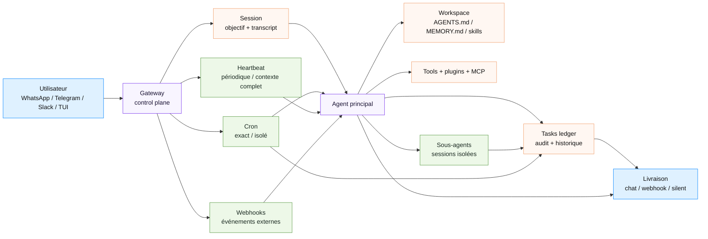

**Traduction simple** :

- `cron` décide **quand** lancer.
- `heartbeat` décide **quand regarder autour** avec le contexte de la session.
- `tasks` dit **ce qui s'est réellement passé**.
- `workspace` dit **ce que l'agent doit toujours savoir**.
- `skills` disent **comment faire une famille de tâches**.
- `sandbox` dit **ce que l'agent n'a pas le droit de toucher**.

---

## État du repo au 25 juin 2026 : ce qui change pour les boucles

Dernier état consulté : OpenClaw affiche une release stable `2026.6.10` publiée le 24 juin 2026, et une pré-release `2026.6.11-beta.1` publiée le 24 juin 2026 en soirée.

Pour les boucles, les points récents les plus importants sont moins “nouvelles commandes magiques” que **fiabilisation du runtime** :

| Zone | Impact boucle |
|---|---|
| **Fast mode automatique** | Les petits échanges conversationnels peuvent être moins coûteux, tandis que les runs longs gardent un mode plus robuste. |
| **Routage modèle plus fiable** | Moins de surprise entre live chat, cron, fallback et provider. |
| **État session / channel plus sûr** | Moins de stale state entre canaux, sessions et livraisons cron. |
| **Politiques trusted conservées dans les hooks composés** | Important pour les flows à approbation sensible. |
| **Cron sur SQLite + run history** | Les jobs, l'état runtime et l'historique survivent mieux aux redémarrages. |
| **Doctor / update / health** | La maintenance devient une brique de boucle : updater, migrer, vérifier, redémarrer. |

**Lecture critique** : OpenClaw est une plateforme qui bouge vite. C'est bon pour tester les boucles, mais risqué pour une boucle permanente trop permissive. Il faut donc versionner les règles, fixer un canal `stable` ou `beta`, et passer par `openclaw doctor` après les updates.

---

## PARTIE 1 · Quand utiliser une boucle OpenClaw

### Le test des 4 conditions

La logique reste la même que pour les autres agents : une boucle ne vaut son coût que si les quatre conditions sont remplies.

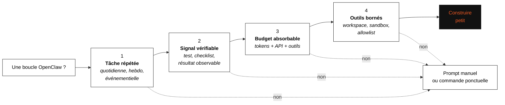

### Ce qu'OpenClaw fait mieux que les agents de code purs

| Cas | Pourquoi OpenClaw est adapté |
|---|---|
| **Assistant personnel multi-canaux** | WhatsApp, Telegram, Slack, TUI, webhooks : la boucle démarre depuis le monde réel, pas seulement depuis un terminal. |
| **Rapports périodiques** | `cron` lance à heure fixe et livre vers chat ou webhook. |
| **Surveillance douce** | `heartbeat` regarde périodiquement l'état de la session sans créer un task record à chaque fois. |
| **Ops personnelle / serveur local** | `openclaw health`, `doctor`, cron, hooks, sandbox et logs créent une boucle d'exploitation. |
| **Automatisations à autorité limitée** | `standing orders` donnent un mandat permanent, mais avec scope, triggers et escalades. |
| **Multi-agent contrôlé** | Les sous-agents sont des tâches de fond avec sessions séparées, utiles pour recherche, longue exécution, vérification. |

### Ce qu'OpenClaw fait moins naturellement

| Cas | Limite | Correctif |
|---|---|---|
| **Refactor code massif** | L'assistant personnel n'est pas une revue d'architecture. | Garder en prompt manuel ou worktree isolé. |
| **Merge automatique** | Trop d'impact irréversible. | PR brouillon + revue humaine. |
| **Boucles secrets / finance / mails sensibles** | Canaux + outils + mémoire = surface d'attaque. | Agent dédié, sandbox, allowlist, approbation. |
| **Très grand catalogue d'outils** | Le contexte peut être mangé par les schémas. | Tool Search ou exposition directe minimale. |
| **Boucle sans signal objectif** | L'agent “se sent” terminé. | Test, build, audit, sortie structurée. |

---

## PARTIE 2 · Les primitives OpenClaw

## Gateway : le control plane

Le Gateway est le cœur opérationnel. Il garde la config, connecte les canaux, lance les sessions, exécute cron, applique les hooks, sert la Control UI, surveille la santé et route les messages.

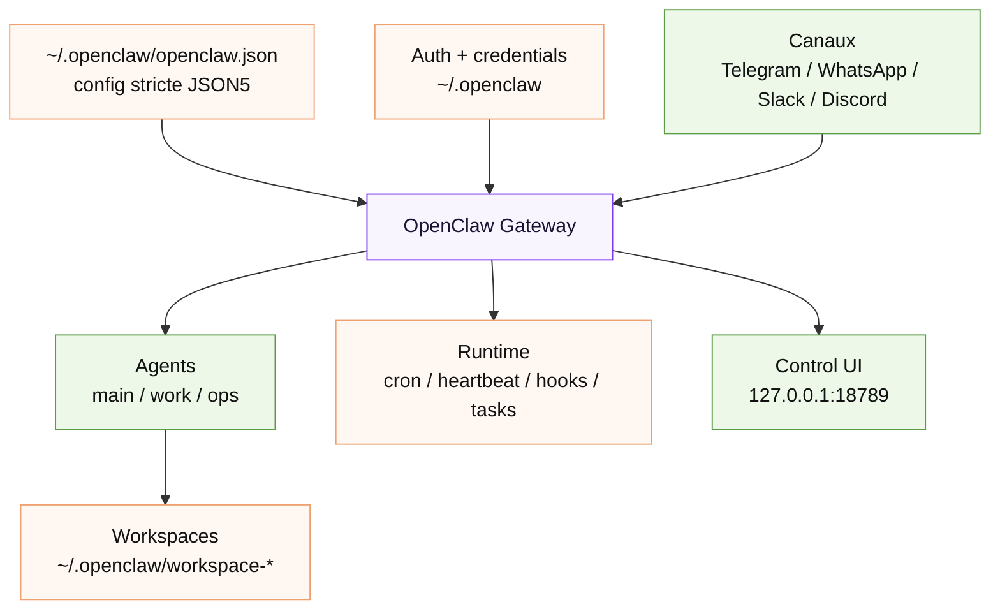

### Config minimale utile pour une boucle

```json5
// ~/.openclaw/openclaw.json
{
  agents: {
    defaults: {
      workspace: "~/.openclaw/workspace",
      heartbeat: {
        every: "1h",
        target: "none"
      },
      sandbox: {
        enabled: true,
        backend: "docker",
        workspaceAccess: "rw"
      }
    }
  },
  channels: {
    telegram: {
      dmPolicy: "allowlist",
      allowFrom: ["<ton_user_id>"]
    }
  }
}
```

**Point critique** : `~/.openclaw/openclaw.json` contrôle des choses très sensibles : canaux, modèles, outils, sandbox, automation. OpenClaw valide strictement la config ; ce n'est pas un fichier fourre-tout.

---

## Workspace : la mémoire opérationnelle

Le workspace est la maison de l'agent. C'est le `cwd` par défaut des outils de fichiers, et la source des fichiers injectés au démarrage.

| Fichier | Rôle dans une boucle |
|---|---|
| `AGENTS.md` | Instructions opérationnelles, règles, standing orders, priorités. |
| `SOUL.md` | Persona, ton, limites comportementales. |
| `USER.md` | Informations utiles sur l'utilisateur. |
| `IDENTITY.md` | Nom, identité, avatar / vibe de l'agent. |
| `TOOLS.md` | Conventions locales d'outils, commandes, chemins. |
| `HEARTBEAT.md` | Mini-checklist périodique ; doit rester court. |
| `BOOT.md` | Checklist au redémarrage Gateway si hooks activés. |
| `MEMORY.md` | Mémoire durable, compacte et curée. |
| `memory/YYYY-MM-DD.md` | Journal de travail détaillé, indexable mais pas injecté à chaque tour. |

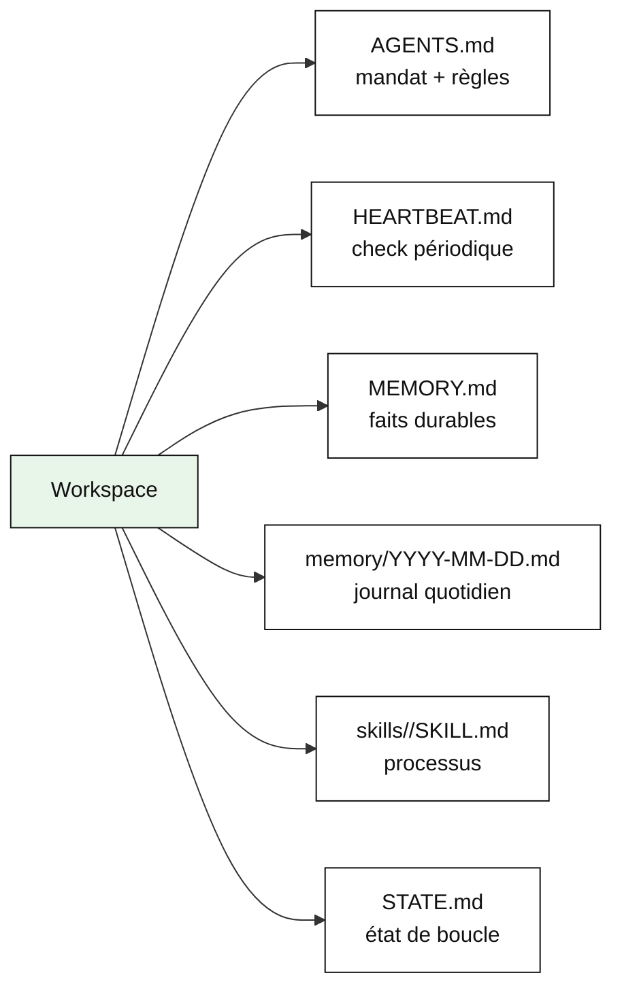

### `STATE.md` recommandé pour les boucles de code

OpenClaw a un task ledger, mais il ne remplace pas un fichier d'état métier dans le dépôt ou workspace. Pour une boucle code, garder un `STATE.md` est plus lisible qu'une mémoire diffuse.

```markdown
# État de boucle · openclaw-ci-triage

## Dernier run
2026-06-25 08:00 Europe/Paris · cron: ok · coût estimé: 0,42 € · tours: 11

## Objectif actif
Réduire les échecs CI simples sur la branche `main` sans toucher aux modules auth/billing.

## Travaux en cours
- `worktrees/ci-auth-lint` — lint corrigé, tests ciblés OK, PR brouillon à créer.
- `worktrees/e2e-flake-login` — flake reproduit 3/10, pas de patch encore.

## Preuves
- `pnpm test src/auth/auth.test.ts` : OK
- `pnpm check` : OK
- CI distante : en attente

## Escalade humaine
- Timeout runner Ubuntu après 20 min : probable infra.
- Fichiers `src/billing/**` détectés dans diff : interdit sans approbation.

## Prochain run
1. Relire les PR ouvertes.
2. Vérifier CI.
3. Fermer ou escalader les tâches sans signal après 2 runs.
```

---

## Cron : la boucle exacte et isolable

`cron` est le battement de cœur **exact** : horaire précis, job persistant, sortie vers chat, webhook ou silence. Les définitions, l'état runtime et l'historique sont stockés dans SQLite, donc les redémarrages ne doivent pas faire disparaître les jobs.

| Type | Usage | Exemple |
|---|---|---|
| One-shot | rappel ou action unique | “demain 16h, vérifier le ticket” |
| Recurring | rapport, triage, check périodique | “tous les jours à 8h” |
| Isolated agent turn | run avec session fraîche ou dédiée | triage CI, rapport inbox |
| Command job | commande shell sans tour agent | export, backup, healthcheck |
| Webhook delivery | intégrer un outil externe | POST résultat vers endpoint |

```bash
# Lister les jobs
openclaw cron list

# Voir un job
openclaw cron show <job-id>

# Créer un run isolé léger tous les matins
openclaw cron create "0 7 * * *" \
  "Résume les changements depuis hier et note uniquement les actions nécessaires." \
  --name "Brief matin" \
  --session isolated \
  --light-context \
  --no-deliver

# Forcer un run et attendre le résultat
openclaw cron run <job-id> --wait --wait-timeout 10m --poll-interval 2s

# Inspecter l'historique
openclaw cron runs --id <job-id> --limit 50
```

### Cron vs Heartbeat

| Dimension | Cron | Heartbeat |
|---|---|---|
| Timing | Exact, expression cron ou one-shot | Approximatif, par défaut périodique |
| Contexte | Session isolée ou partagée | Contexte complet de la session principale |
| Task record | Toujours créé | Non |
| Livraison | Chat, webhook ou silent | Inline dans la session principale |
| Meilleur usage | Rapports, rappels, jobs de fond | Inbox checks, calendrier, notifications douces |

**Règle simple** :

- Besoin d'une heure précise, d'une trace d'exécution ou d'un run isolé → `cron`.
- Besoin d'une vigilance périodique liée au contexte courant → `heartbeat`.

---

## Heartbeat : la boucle de vigilance douce

Heartbeat lance périodiquement un tour dans la session principale. Il est utile pour :

- vérifier `HEARTBEAT.md` ;
- livrer un commitment inféré ;
- réveiller l'agent si un task détaché a terminé ;
- éviter d'avoir 15 cron jobs pour des micro-checks contextuels.

```markdown
# HEARTBEAT.md

<!-- Garder court : ce fichier est lu régulièrement. -->

- Vérifier s'il existe un résultat de task détaché à résumer.
- Vérifier s'il y a un engagement dû aujourd'hui.
- Si rien n'a changé, répondre HEARTBEAT_OK.
```

**Point économique** : si `HEARTBEAT.md` est vide ou quasi vide, OpenClaw peut éviter le run pour économiser des appels. Donc ne transforme pas ce fichier en `AGENTS.md` bis.

---

## Goal : garder le cap, pas planifier le travail

`/goal` attache un objectif durable à la session courante. Il survit aux redémarrages et reste visible à l'agent. Mais ce n'est **pas** une task queue.

| Commande | Effet |
|---|---|
| `/goal start <objectif>` | Crée un objectif pour la session courante. |
| `/goal` ou `/goal status` | Affiche l'objectif, le statut et le budget. |
| `/goal pause <note>` | Met en pause volontaire. |
| `/goal block <note>` | Marque un vrai blocage. |
| `/goal resume` | Reprend depuis le même objectif. |
| `/goal complete <note>` | Marque comme atteint. |
| `/goal clear` | Supprime l'objectif de la session. |

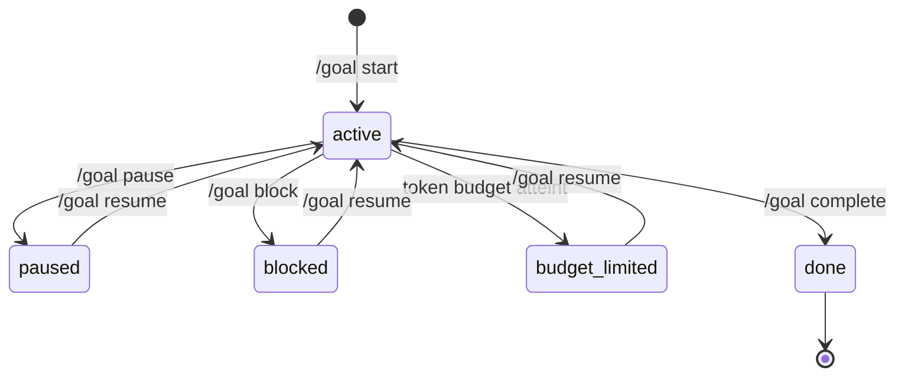

### Bon usage

```text
/goal start Obtenir une CI verte pour la PR 87469 sans toucher à src/billing,
avec preuve pnpm check + test ciblé + résumé du diff.
```

### Mauvais usage

```text
/goal start Gère tout ce qui est important sur mon serveur.
```

Un goal doit être :

1. **concret** ;
2. **vérifiable** ;
3. **borné** ;
4. **attaché à une session** ;
5. **séparé de la planification**.

Pour du travail détaché, répété, fan-out ou durable : utiliser `cron`, `tasks`, `Task Flow` ou `standing orders`.

---

## Tasks et Task Flow : le journal, pas le réveil

Les `tasks` sont le registre du travail détaché. Elles ne planifient pas : elles enregistrent ce qui a été lancé, par qui, quand, avec quel statut.

| Source | Crée une task ? |
|---|---|
| Cron | Oui |
| Sub-agent | Oui |
| ACP run | Oui |
| CLI agent command | Oui |
| Heartbeat | Non |
| Chat interactif normal | Non |

Statuts typiques :

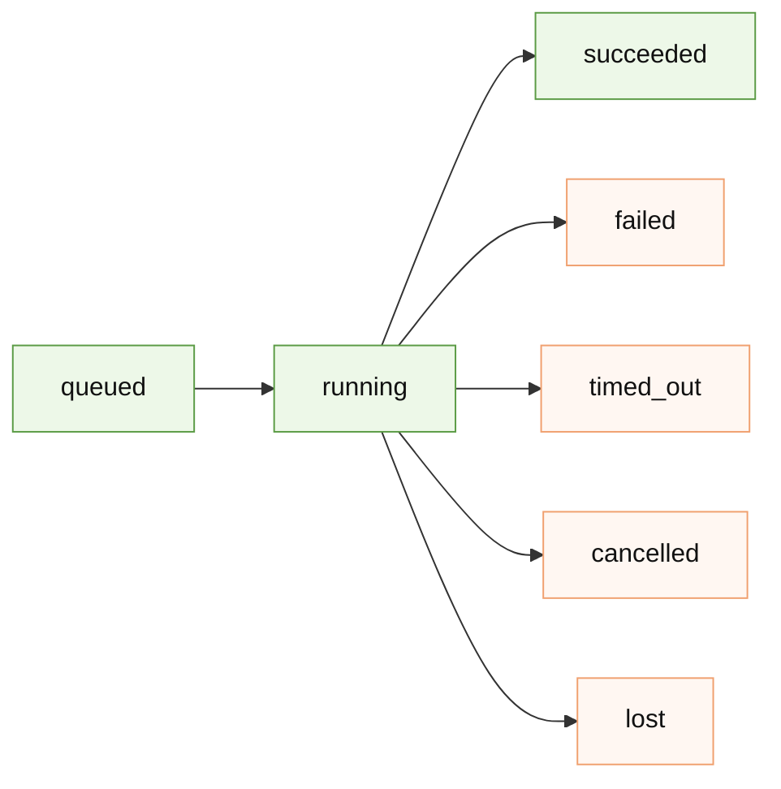

Commandes utiles :

```bash
openclaw tasks list
openclaw tasks audit
openclaw tasks flow list
openclaw tasks flow show <flow-id>
openclaw tasks flow cancel <flow-id>
```

**Erreur classique** : faire une boucle de polling sur `/subagents list` ou `tasks list`. OpenClaw favorise les complétions push : un travail détaché annonce son résultat ou réveille la session. Le polling continu coûte et n'améliore pas la fiabilité.

---

## Standing orders : l'autorité permanente

Les standing orders sont le point le plus “boucle produit”. Au lieu de redemander une tâche, tu donnes un **mandat permanent** : scope, triggers, gates, escalade.

À mettre de préférence dans `AGENTS.md`, car il est auto-injecté à chaque session.

```markdown
# Standing order · triage CI

## Scope
Tu peux inspecter les échecs CI, lire les logs, créer un worktree, proposer un patch simple,
et ouvrir une PR brouillon.

## Triggers
- Tous les jours à 8h via cron.
- À la réception d'un webhook GitHub indiquant CI failed.

## Approval gates
- Ne jamais merger.
- Ne jamais modifier `src/auth/**`, `src/billing/**` ou `infra/prod/**` sans approbation.
- Ne jamais désactiver un test.

## Escalation
Escalader si :
- le même échec survit à 2 runs ;
- le diff touche une zone interdite ;
- le fix nécessite une décision produit ;
- le coût dépasse le budget du run.

## Output
Toujours écrire : hypothèse, fichiers touchés, commandes exécutées, preuve, prochaine action.
```

**Bonne séparation** :

| Élément | Où le mettre |
|---|---|
| Mandat permanent | `AGENTS.md` |
| Processus détaillé | `skills/<nom>/SKILL.md` |
| État courant | `STATE.md` ou task ledger |
| Déclenchement exact | `cron` |
| Vigilance contextuelle | `HEARTBEAT.md` |

---

## Skills : la connaissance procédurale

Les skills sont des fichiers Markdown `SKILL.md` avec frontmatter YAML. Elles enseignent à l'agent **comment et quand utiliser des outils**.

OpenClaw charge les skills depuis plusieurs sources, avec priorité :

| Priorité | Source | Chemin typique |
|---|---|---|
| 1 | Workspace skills | `<workspace>/skills` |
| 2 | Project agent skills | `<workspace>/.agents/skills` |
| 3 | Personal agent skills | `~/.agents/skills` |
| 4 | Managed / local skills | `~/.openclaw/skills` |
| 5 | Bundled skills | install OpenClaw |
| 6 | Extra dirs + plugin skills | config |

### Exemple skill de boucle

```markdown
---
name: ci-triage
summary: Classer les échecs CI, proposer les correctifs simples, escalader le reste.
when: "Échec CI, cron quotidien ou demande explicite de triage CI."
---

# Skill · CI triage

## Entrées
- Lien PR ou branche
- Dernier run CI
- Fichier `STATE.md`

## Étapes
1. Lire `STATE.md`.
2. Identifier le run CI le plus récent.
3. Classer l'échec : env, flake, bug, dependency, infra, inconnu.
4. Reproduire localement si possible.
5. Si bug simple : créer un worktree et patcher.
6. Lancer la porte : `pnpm check` + test ciblé.
7. Mettre à jour `STATE.md`.

## Interdits
- Ne jamais désactiver un test.
- Ne jamais modifier auth/billing/prod sans approbation.
- Ne jamais livrer sans preuve objective.

## Sortie obligatoire
- Classification
- Commandes exécutées
- Fichiers modifiés
- Preuve
- Décision : PR brouillon, retry, escalade ou stop
```

### Point sécurité sur les skills

OpenClaw peut installer des skills communautaires. C'est puissant, mais une skill est aussi une **injection d'instructions persistante**. Pour une boucle sérieuse :

- auditer le `SKILL.md` ;
- vérifier les scripts auxiliaires ;
- pin la source / version ;
- éviter les skills qui demandent un accès trop large ;
- préférer les skills workspace pour les processus critiques.

---

## Hooks : automatiser autour de la session

OpenClaw distingue deux familles :

| Type | Usage |
|---|---|
| **Internal hooks** | Scripts autour du Gateway : `/new`, `/reset`, `/stop`, compaction, startup, message flow. |
| **Plugin hooks typés** | Middleware plus fin : bloquer un tool, réécrire un prompt, annuler un message, ajouter de la policy. |

Événements utiles pour les boucles :

| Événement | Usage |
|---|---|
| `command:new` | Initialiser un état de session. |
| `command:reset` | Sauvegarder avant purge. |
| `command:stop` | Écrire un résumé dans `memory/YYYY-MM-DD.md`. |
| `session:compact:before` | Archiver avant perte de détails. |
| `agent:bootstrap` | Contrôler les fichiers injectés. |
| `gateway:startup` | Lancer une checklist `BOOT.md`. |

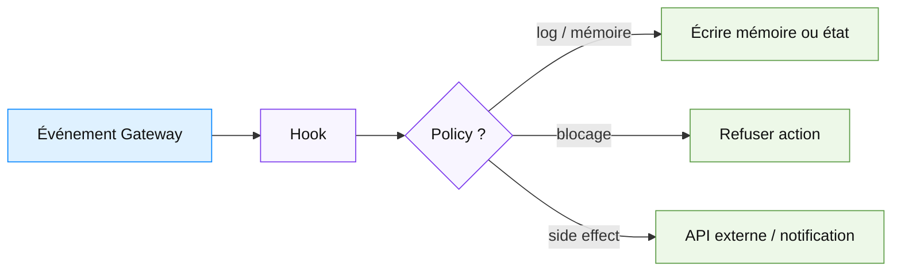

**Bon usage** : écrire l'état, auditer, bloquer une commande dangereuse.

**Mauvais usage** : cacher de la logique métier critique dans un script invisible que personne ne relit.

---

## Sub-agents : paralléliser sans polluer la session principale

Les sub-agents sont des runs d'agent en arrière-plan, avec leur propre session. Ils sont faits pour les tâches longues, lentes ou parallèles.

| Propriété | Conséquence |
|---|---|
| Session séparée | Le contexte principal reste plus léger. |
| Task record | Le travail est visible dans `tasks`. |
| Pas de session tools par défaut | Surface d'outil plus difficile à détourner. |
| Completion push | Le parent reçoit le résultat ; inutile de poller en boucle. |
| Coût séparé | Chaque sub-agent a son contexte et ses tokens. |

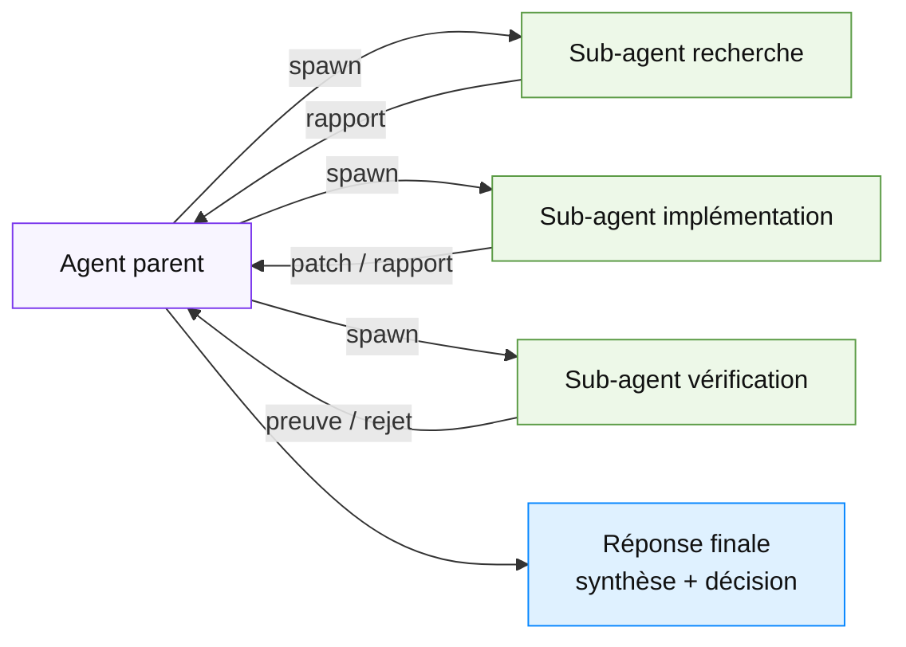

### Pattern recommandé

| Sous-agent | Modèle | Outils | Mission |
|---|---|---|---|
| `researcher` | cheap / rapide | lecture, web, grep | Trouver les faits, pas modifier. |
| `fixer` | meilleur modèle | read/edit/bash bornés | Corriger une zone précise. |
| `reviewer` | modèle différent si possible | lecture + tests | Vérifier contre la spec et la porte. |

---

## Agents multiples et bindings de canaux

OpenClaw peut avoir plusieurs agents, chacun avec son workspace, ses skills visibles, son modèle et ses bindings de canaux.

Exemples :

```bash
# Créer un agent de travail séparé
openclaw agents add work \
  --workspace ~/.openclaw/workspace-work \
  --bind telegram:work \
  --non-interactive

# Créer un agent ops
openclaw agents add ops \
  --workspace ~/.openclaw/workspace-ops \
  --bind telegram:ops \
  --non-interactive

# Lister les bindings
openclaw agents bindings --json
```

| Agent | Workspace | Skills | Canaux | Usage |
|---|---|---|---|---|
| `main` | `~/.openclaw/workspace` | perso, mémoire | DM personnel | assistant général |
| `work` | `~/.openclaw/workspace-work` | code, GitHub, docs | channel work | tâches pro |
| `ops` | `~/.openclaw/workspace-ops` | serveur, monitoring | channel ops | maintenance |

**Règle forte** : ne pas mettre tous les pouvoirs sur `main`. Le confort d'un assistant unique crée une concentration de risques.

---

## Plugins, MCP et Tool Search

OpenClaw peut exposer beaucoup d'outils : outils natifs, plugins, MCP, client tools. Le piège est de tout donner à l'agent au démarrage.

| Surface | Usage |
|---|---|
| **Tool plugins** | Ajouter des outils appelables par l'agent. |
| **Plugin hooks** | Intercepter / contrôler le cycle d'exécution. |
| **MCP** | Brancher GitHub, Jira, DB, services externes. |
| **Tool Search** | Ne pas injecter tous les schémas d'outils upfront. |

Tool Search donne au modèle une interface compacte pour chercher, décrire et appeler les outils nécessaires, au lieu de saturer le contexte avec tout le catalogue.

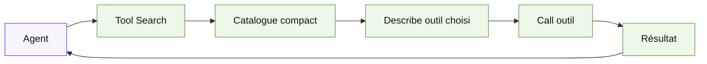

**Règle économique** : plus il y a d'outils, plus il faut une stratégie de découverte. Pour une petite boucle, mieux vaut une allowlist courte qu'un catalogue géant.

---

## Sandbox : l'isolation n'est pas optionnelle

Le workspace OpenClaw est le `cwd` par défaut, **pas** un vrai sandbox. Les chemins absolus peuvent sortir du workspace si le sandboxing n'est pas activé.

Backends typiques :

| Backend | Usage |
|---|---|
| Docker | Isolation locale standard. |
| SSH | Runtime distant, utile sur serveur ou VM. |
| OpenShell | Runtime shell isolé / remote selon config. |

Commandes utiles :

```bash
# Comprendre le sandbox effectif
openclaw sandbox explain
openclaw sandbox explain --agent work
openclaw sandbox explain --json

# Lister les runtimes
openclaw sandbox list
openclaw sandbox list --json

# Recréer après update ou changement de config
openclaw sandbox recreate --all
openclaw sandbox recreate --agent work
```

### Politique minimale de boucle

| Zone | Politique |
|---|---|
| Workspace | Un workspace par agent sensible. |
| Code | Un worktree par tâche. |
| Secrets | Pas d'env large ; passer uniquement ce qui est nécessaire. |
| Tools | Allowlist courte. |
| Réseau | Pas d'exposition publique du Gateway sans besoin explicite. |
| Canaux | `dmPolicy: allowlist` ou pairing, jamais `open` par confort. |

---

## Worktrees avec OpenClaw

OpenClaw n'est pas principalement un gestionnaire de worktrees comme Codex. Pour des boucles de code, il faut les construire explicitement.

### Pattern simple

```bash
mkdir -p ~/worktrees
cd ~/src/mon-projet

git fetch origin

git worktree add ~/worktrees/ci-fix-auth -b openclaw/ci-fix-auth origin/main
cd ~/worktrees/ci-fix-auth

# Lancer OpenClaw avec un workspace ou une consigne qui pointe vers ce répertoire
```

### Pattern multi-agent

| Agent | Workspace | Worktree courant | Rôle |
|---|---|---|---|
| `work` | `~/.openclaw/workspace-work` | `~/worktrees/feature-a` | Implémentation |
| `review` | `~/.openclaw/workspace-review` | `~/worktrees/feature-a` en lecture | Vérification |
| `ops` | `~/.openclaw/workspace-ops` | aucun dépôt sensible | Cron / reports |

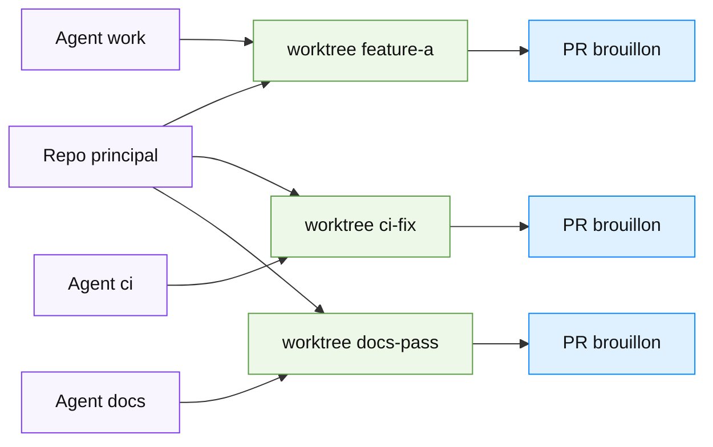

**Limite franche** : les worktrees éliminent les collisions de fichiers, pas la charge de revue.

---

## PARTIE 3 · Construire la boucle OpenClaw minimale

La boucle minimale viable avec OpenClaw :

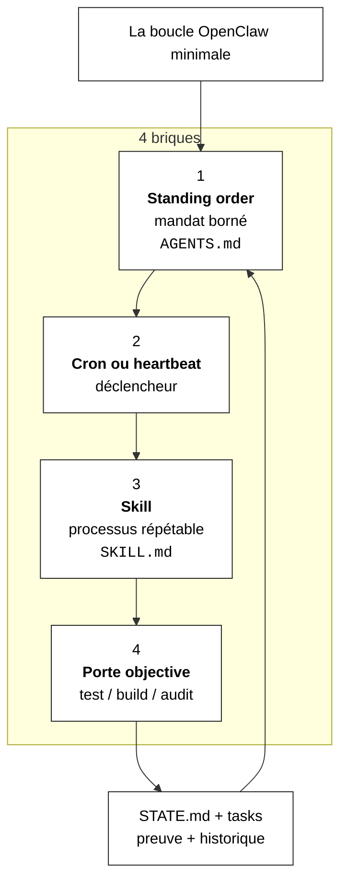

### Ordre de construction

| Étape | Action | Sortie |
|---|---|---|
| 1 | Run manuel dans une session normale | Prompt qui marche une fois. |
| 2 | Créer `STATE.md` | L'agent sait reprendre. |
| 3 | Extraire une skill | Le processus devient stable. |
| 4 | Ajouter une porte objective | La boucle peut dire non. |
| 5 | Ajouter cron ou heartbeat | Le run devient autonome. |
| 6 | Ajouter sub-agent vérificateur | Le faiseur ne se note plus seul. |
| 7 | Ajouter sandbox / permissions | La boucle devient exploitable. |

### Exemple complet : triage CI quotidien

#### 1. `AGENTS.md`

```markdown
# Agent work · règles de boucle

Tu peux aider sur le dépôt `~/src/app`, mais tout changement doit passer par un worktree.

## Interdits
- Ne jamais merger.
- Ne jamais push sur `main`.
- Ne jamais modifier `src/billing/**`, `src/auth/**`, `.github/workflows/**` sans approbation.
- Ne jamais désactiver un test pour faire passer la CI.

## Porte obligatoire
Avant de proposer une PR :
- `pnpm check`
- test ciblé lié au fichier modifié
- résumé du diff
- mise à jour `STATE.md`
```

#### 2. `skills/ci-triage/SKILL.md`

```markdown
---
name: ci-triage
summary: Triage CI borné avec worktree, reproduction, patch simple et escalade.
---

# CI triage

1. Lire `STATE.md`.
2. Identifier l'échec CI le plus récent.
3. Classer : env, flake, bug, dependency, infra, inconnu.
4. Créer ou réutiliser un worktree `~/worktrees/openclaw-ci-*`.
5. Reproduire localement.
6. Patch uniquement si la cause est locale et simple.
7. Lancer la porte.
8. Mettre à jour `STATE.md`.
9. Sortir avec : classification, preuve, décision.
```

#### 3. Cron

```bash
openclaw cron create "0 8 * * 1-5" \
  "Utilise la skill ci-triage sur le dépôt app. Si aucun échec clair n'existe, écris NO_REPLY." \
  --name "CI triage morning" \
  --agent work \
  --session isolated \
  --light-context \
  --tools read,exec \
  --model openrouter/gpt-5-mini \
  --no-deliver
```

#### 4. Vérification humaine

```bash
openclaw cron runs --id <job-id> --limit 10
openclaw tasks audit
cd ~/worktrees/openclaw-ci-*
git diff
pnpm check
```

---

## Patterns prêts à l'emploi

### Pattern 1 — Rapport quotidien silencieux sauf action

| Élément | Choix |
|---|---|
| Déclencheur | `cron` tous les matins |
| Contexte | `--light-context` |
| Sortie | `NO_REPLY` si rien à signaler |
| État | `memory/YYYY-MM-DD.md` + éventuel `STATE.md` |

```bash
openclaw cron create "0 7 * * *" \
  "Lis HEARTBEAT.md et les notes récentes. Réponds uniquement s'il y a une action concrète." \
  --name "Morning action scan" \
  --session isolated \
  --light-context
```

### Pattern 2 — Surveillance douce via heartbeat

| Élément | Choix |
|---|---|
| Déclencheur | heartbeat `1h` |
| Contexte | session principale complète |
| Sortie | `HEARTBEAT_OK` si rien |
| Risque | bruit et coût si checklist trop large |

```json5
{
  agents: {
    defaults: {
      heartbeat: {
        every: "1h",
        target: "none"
      }
    }
  }
}
```

### Pattern 3 — Sous-agent vérificateur

```text
Spawn un sub-agent reviewer avec outils lecture + tests uniquement.
Mission : vérifier que le diff respecte AGENTS.md et que la porte objective passe.
Ne pas corriger. Retourner seulement : ACCEPT / REJECT + preuves.
```

### Pattern 4 — Agent ops séparé

```bash
openclaw agents add ops \
  --workspace ~/.openclaw/workspace-ops \
  --bind telegram:ops \
  --non-interactive
```

`ops` reçoit les cron serveur, `work` reçoit les boucles code, `main` garde la conversation personnelle.

### Pattern 5 — Gateway maintenance loop

```bash
openclaw update --dry-run
openclaw update
openclaw doctor
openclaw gateway restart
openclaw health
```

À lancer manuellement ou à transformer en cron **lecture seule** qui signale les actions à faire, sans auto-update sur une machine sensible.

---

## Garde-fous de production

| Risque | Garde-fou |
|---|---|
| Gateway exposé | Localhost, VPN privé, allowlist, pairing ; pas de DM open. |
| Skills malveillantes | Audit, pin, ClawHub verify, pas d'installation automatique. |
| Mémoire polluée | Distinguer `MEMORY.md` durable et `memory/*.md` journal. |
| Secrets dans env | SecretRef / sandbox config, pas d'env globale injectée partout. |
| Cron trop fréquent | Cadence minimale, `NO_REPLY`, logs surveillés. |
| Sub-agents en cascade | Profondeur max, modèle cheap, mission courte. |
| Tool catalog énorme | Tool Search ou allowlist stricte. |
| Workspace pas isolé | Activer sandbox ; un workspace par agent sensible. |
| Boucle de code trop large | Worktree + porte + PR brouillon. |
| Auto-validation | Reviewer séparé + test objectif. |

### La taxe sécurité spécifique OpenClaw

OpenClaw touche à des choses que les agents de code ne touchent pas toujours : messagerie, calendrier, mails, navigateur, système local, plugins communautaires, mémoire durable. La surface d'attaque vient de la combinaison :

$$
Risque \approx Pouvoirs \times Persistance \times Canaux \times Fréquence
$$

Donc la bonne réponse n'est pas “ne pas utiliser OpenClaw”. C'est :

1. réduire les pouvoirs par agent ;
2. isoler les workspaces ;
3. sandboxer ;
4. limiter les canaux ;
5. auditer les skills ;
6. garder des portes objectives ;
7. préférer les PR brouillons aux actions irréversibles.

---

## Coûts et tokens

OpenClaw consomme à chaque réveil : bootstrap workspace, instructions, skills visibles, tool schemas ou Tool Search, historique, mémoire, sorties d'outils, sub-agents.

| Poste | Pourquoi ça coûte | Levier |
|---|---|---|
| Heartbeat trop fréquent | Même sans action, il peut appeler le modèle. | `HEARTBEAT.md` court, cadence plus lente, skip si vide. |
| Cron verbeux | Logs + historique + livraison. | `--light-context`, `NO_REPLY`, output borné. |
| Skills nombreuses | Catalogues injectés / compilés. | Agent allowlists, skills par workspace. |
| Plugins nombreux | Schémas et outils en contexte. | Tool Search, allowlist. |
| Sub-agents | Contextes séparés. | Modèle moins cher, mission brève. |
| Mémoire longue | Bootstrap tronqué ou cher. | `MEMORY.md` compact, détails dans `memory/*.md`. |
| Browser automation | Lent, fragile, état externe. | Sandbox + cleanup + timeout. |

### Métriques à suivre

| Métrique | Pourquoi |
|---|---|
| Coût par changement accepté | Mesure business réelle. |
| Taux de `NO_REPLY` | Si bas, la boucle spamme ou produit trop de bruit. |
| Taux de tasks `failed/timed_out/lost` | Santé runtime. |
| Nombre de wakes par jour | Coût récurrent. |
| Nombre de skills visibles par agent | Surface contexte + sécurité. |
| Temps de revue humaine | Goulot réel. |

---

## Erreurs qui transforment OpenClaw en gouffre

| Erreur | Symptôme | Correctif |
|---|---|---|
| Tout faire avec `main` | Mémoire, canaux et outils mélangés. | Agents séparés. |
| Mettre des standing orders vagues | L'agent agit trop largement. | Scope + triggers + gates + escalade. |
| Confondre `/goal` et task queue | Objectif bloqué ou mal repris. | Cron / Task Flow pour le détaché. |
| Heartbeat bavard | Notifications inutiles, coût invisible. | `HEARTBEAT_OK`, checklist courte. |
| Installer trop de skills | Prompt bloat + injection. | Allowlist, audit. |
| Pas de sandbox | L'agent peut sortir du workspace. | `sandbox explain`, Docker/SSH/OpenShell. |
| Polling sub-agents | Coût et bruit. | Completion push, inspecter seulement en debug. |
| Cron sans modèle explicite | Surprise de provider/fallback. | `--model`, `--fallbacks`, `doctor`. |
| Boucle code sans worktree | Conflits et diff sale. | `git worktree` par tâche. |
| Boucle sans preuve | “Ça devrait marcher.” | Test/build/audit obligatoire. |

---

## OpenClaw vs Hermes vs Claude Code — lecture pratique

| Critère | OpenClaw | Hermes | Claude Code |
|---|---|---|---|
| Centre de gravité | Assistant personnel multi-canaux | Agent auto-améliorant / mémoire / skills | Agent de code + SDK |
| Déclenchement | Gateway, cron, heartbeat, webhooks | cron, `/goal`, kanban, profils | `/loop`, `/goal`, hooks, SDK |
| Mémoire | Markdown workspace + plugins mémoire | mémoire profonde + skills évolutives | fichiers projet + session SDK |
| Multi-agent | agents, bindings, sub-agents, ACP | profils, sous-agents, kanban | sub-agents / Task tool |
| Code | Possible, mais à structurer | Possible, fort sur continuité | Natif, le plus direct |
| Canaux | Très fort | Fort | Plutôt terminal / IDE / SDK |
| Risque principal | Trop de pouvoirs persistants | Boucle qui s'auto-convainc | Coût + dette de compréhension |
| Meilleur usage | Assistant autonome local / ops perso | Agent qui apprend tes routines | Dev et CI sur repo |

**Conclusion comparative** :

- Pour piloter ta machine Ubuntu, des canaux, du cron, de la mémoire et des automatisations personnelles : **OpenClaw** est naturel.
- Pour faire émerger des skills et routines qui s'améliorent avec l'usage : **Hermes** est plus orienté apprentissage.
- Pour coder dans un dépôt avec vérifications fortes : **Claude Code** reste plus spécialisé.

---

## Checklist de mise en place sur une machine Ubuntu locale

```bash
# 1. Mettre à jour proprement
openclaw update --dry-run
openclaw update
openclaw doctor
openclaw gateway restart
openclaw health

# 2. Vérifier la config sensible
openclaw config get agents.defaults.workspace
openclaw config get agents.defaults.sandbox
openclaw config get channels

# 3. Vérifier sandbox
openclaw sandbox explain
openclaw sandbox list

# 4. Créer les agents séparés
openclaw agents list
openclaw agents add work --workspace ~/.openclaw/workspace-work --non-interactive
openclaw agents add ops --workspace ~/.openclaw/workspace-ops --non-interactive

# 5. Créer les fichiers de boucle
mkdir -p ~/.openclaw/workspace-work/skills/ci-triage
$EDITOR ~/.openclaw/workspace-work/AGENTS.md
$EDITOR ~/.openclaw/workspace-work/HEARTBEAT.md
$EDITOR ~/.openclaw/workspace-work/STATE.md
$EDITOR ~/.openclaw/workspace-work/skills/ci-triage/SKILL.md

# 6. Ajouter un cron test, sans livraison
openclaw cron create "*/30 * * * *" \
  "Test de boucle : lis STATE.md, ne modifie rien, réponds NO_REPLY si aucune action." \
  --name "Loop smoke test" \
  --agent work \
  --session isolated \
  --light-context \
  --no-deliver

# 7. Observer avant d'élargir
openclaw cron list
openclaw cron runs --id <job-id>
openclaw tasks audit
```

---

## Conclusion

OpenClaw est probablement l'un des meilleurs candidats pour des boucles **personnelles, multi-canaux et persistantes**. Mais ce n'est pas parce qu'un agent peut lire tes messages, lancer des commandes, retenir des choses et se réveiller tout seul qu'il faut lui donner un mandat large.

La bonne boucle OpenClaw est petite :

1. un agent dédié ;
2. un workspace dédié ;
3. un `AGENTS.md` avec mandat borné ;
4. une skill pour le processus ;
5. un `STATE.md` lisible ;
6. un déclencheur `cron` ou `heartbeat` ;
7. une porte objective ;
8. un sandbox ;
9. une revue humaine avant action irréversible.

**La formule courte :**

> OpenClaw n'est pas une boucle de prompt. C'est une boucle d'autorité.  
> La question n'est donc pas seulement “que peut-il faire ?”, mais “qu'a-t-il le droit de faire sans moi ?”.

---

## Sources consultées

- OpenClaw repository — https://github.com/openclaw/openclaw
- OpenClaw releases — https://github.com/openclaw/openclaw/releases
- Automation — https://docs.openclaw.ai/automation
- Scheduled tasks / cron — https://docs.openclaw.ai/automation/cron-jobs
- Cron CLI — https://docs.openclaw.ai/cli/cron
- Heartbeat — https://docs.openclaw.ai/gateway/heartbeat
- Goal — https://docs.openclaw.ai/tools/goal
- Background tasks — https://docs.openclaw.ai/automation/tasks
- Standing orders — https://docs.openclaw.ai/automation/standing-orders
- Skills — https://docs.openclaw.ai/tools/skills
- Hooks — https://docs.openclaw.ai/automation/hooks
- Sub-agents — https://docs.openclaw.ai/tools/subagents
- Agent workspace — https://docs.openclaw.ai/concepts/agent-workspace
- Memory overview — https://docs.openclaw.ai/concepts/memory
- Sandbox CLI — https://docs.openclaw.ai/cli/sandbox
- Agents CLI — https://docs.openclaw.ai/cli/agents
- Tool Search — https://docs.openclaw.ai/tools/tool-search
- Updating — https://docs.openclaw.ai/install/updating
