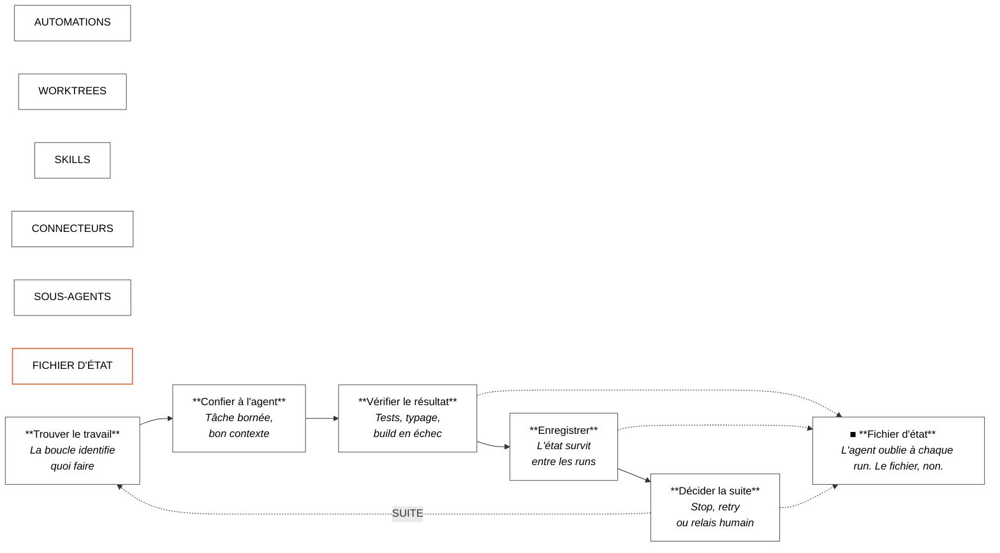
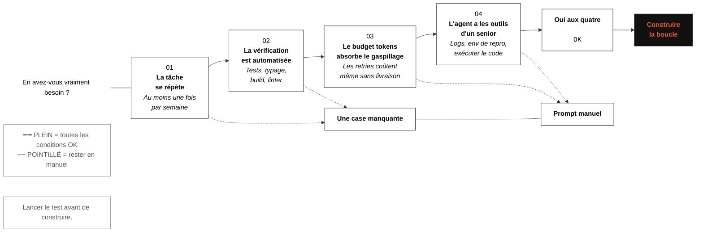
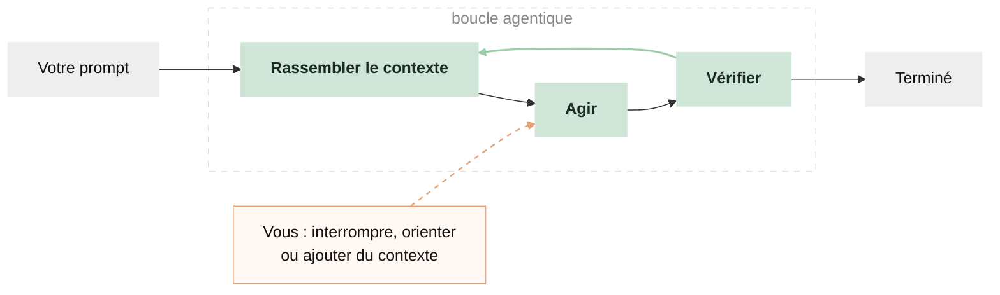
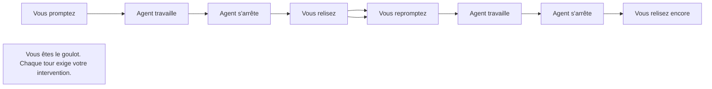
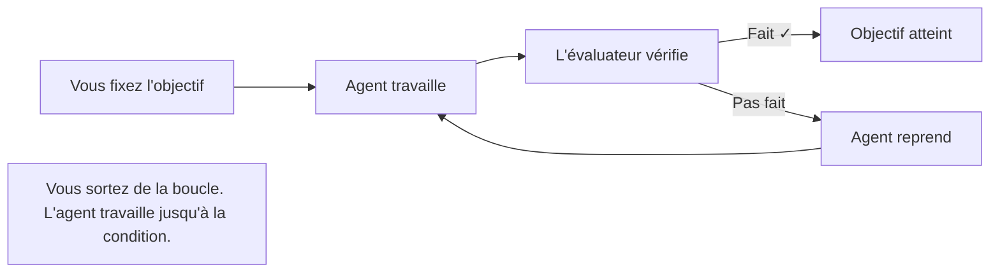
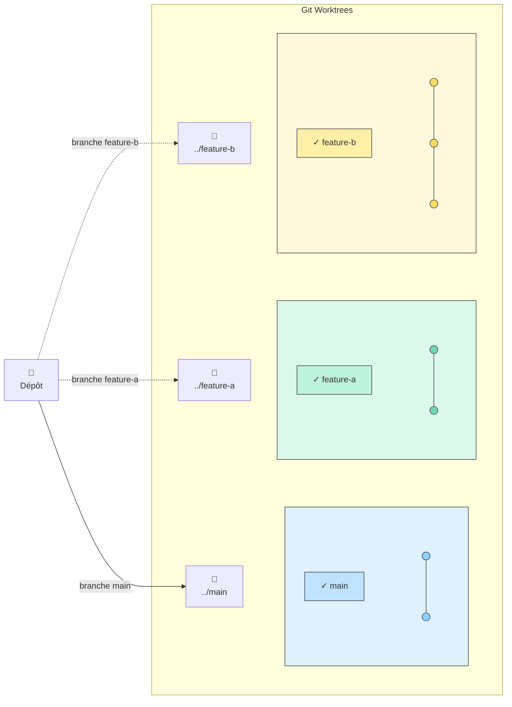
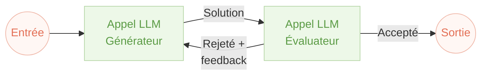
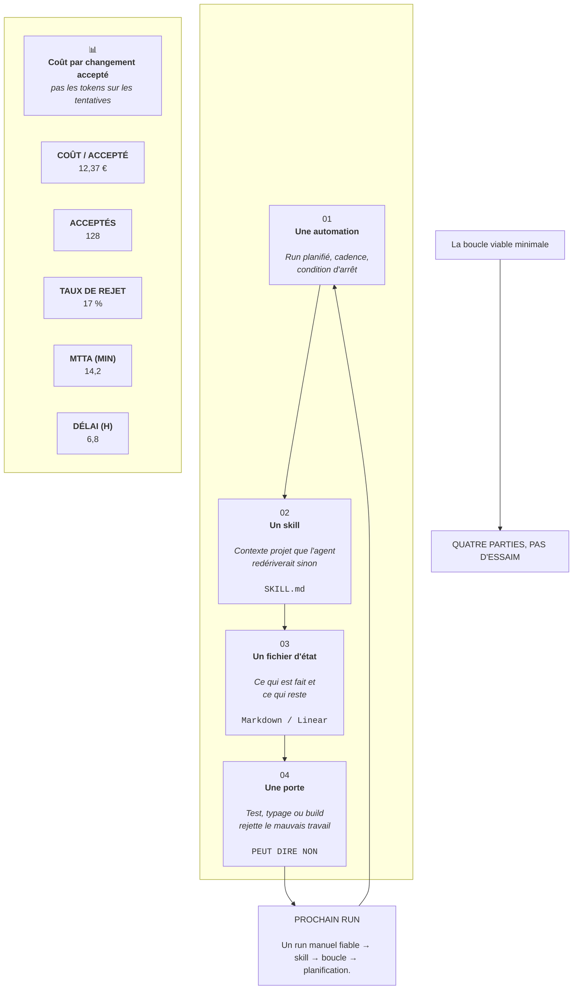
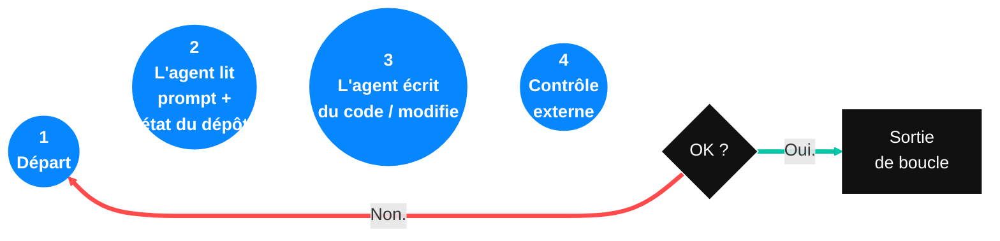

La plupart des développeurs pilotent encore leurs agents de code à la main : taper, attendre, lire le diff, retaper. Le levier a changé — il ne s'agit plus d'écrire de meilleurs prompts, mais de concevoir des **systèmes qui promptent à votre place**.

**14 étapes, 3 niveaux** : vérifier si vous avez besoin d'une boucle, comprendre ce qui se passe sous le capot, maîtriser les cinq blocs de base, puis construire la plus petite boucle viable.

**Boucle agentique (niveau produit)** — Système qui trouve le travail, le confie à l'agent, vérifie, enregistre l'état et décide de la suite, souvent sur un planning.

**Boucle d'exécution (niveau agent)** — Cycle interne d'une session : l'agent évalue, appelle des outils, reçoit les résultats, recommence jusqu'à produire une réponse finale ou atteindre une limite. C'est ce moteur que les automations et les SDK réutilisent.



---

## PARTIE 1 · Le pourquoi et le test

### 01. L'ingénierie de boucle remplace le prompteur manuel

Pendant longtemps, travailler avec un agent de code signifiait : écrire un prompt, partager le contexte, lire la réponse, écrire le suivant. Vous teniez l'outil du début à la fin. Cette phase touche à sa fin.

**L'ingénierie de boucle**, c'est construire un petit système qui trouve le travail, le confie à l'agent, vérifie le résultat, enregistre ce qui s'est passé et décide de la suite — **de façon autonome**. Vous concevez ce système une fois ; ensuite, c'est lui qui prompte l'agent.

Six briques élémentaires :

| Brique | Rôle dans la boucle | Codex | Claude Code |
|---|---|---|---|
| Automations | découverte + triage planifié | Onglet Automations : projet, prompt, cadence, environnement ; résultats dans une boîte Triage ; `/goal` pour tourner jusqu'à la fin | Tâches planifiées et cron, `/loop`, `/goal`, hooks, GitHub Actions |
| Worktrees | isoler des features en parallèle | Worktree intégré par fil de discussion | `git worktree`, `--worktree`, isolation worktree sur un sous-agent |
| Skills | codifier la connaissance projet | Agent Skills (`SKILL.md`), invoqués avec `$name` ou implicitement | Agent Skills (`SKILL.md`) |
| Plugins / connecteurs | relier vos outils | Connecteurs (MCP) + plugins | Serveurs MCP + plugins |
| Sous-agents | explorer et vérifier | Sous-agents en TOML dans `.codex/agents/` | Sous-agents Task dans `.claude/agents/`, équipes d'agents |
| État | suivre ce qui est fait | Markdown ou Linear via connecteur | Markdown (`CLAUDE.md`, `STATE.md`, `AGENTS.md`) ou Linear via MCP ; SDK : `session_id` pour reprendre |

Le levier s'est déplacé : de la saisie de prompts à la conception de la boucle qui prompte.

### 02. Passer le test des 4 conditions avant de construire

Une boucle ne vaut son coût que si **les quatre conditions** ci-dessous sont remplies. En manquer une, et elle coûte plus qu'elle ne rapporte.



**Les quatre conditions, en clair :**

| # | Condition | Pourquoi |
|---|---|---|
| 1 | **La tâche se répète** | Une boucle amortit son coût de mise en place sur de nombreux runs. Pour un travail ponctuel, un bon prompt suffit. |
| 2 | **La vérification est automatisée** | Il faut un signal objectif qui peut rejeter le travail sans vous. Sans ça, vous relisez chaque diff — le travail que la boucle devait éliminer. |
| 3 | **Le budget tokens absorbe le gaspillage** | Les boucles relisent le contexte, retentent, explorent. Ça consomme des tokens même quand rien n'est livré. |
| 4 | **L'agent a les outils d'un ingénieur senior** | Logs, environnement de reproduction, capacité à exécuter le code et voir ce qui casse. Sans ça, la boucle itère à l'aveugle. |

### 03. Qui gagne, qui perd

Les boucles favorisent ceux qui peuvent **dépenser** en tokens et en revue.

**Qui en profite en pratique :**

- Équipes avec travail répétitif et vérifiable par machine — triage CI, mises à jour de dépendances, passes lint-and-fix, brouillons issue→PR sur une base bien testée
- Codebases avec une suite de tests solide : si un junior pourrait faire la tâche avec une checklist et que les tests attrapent les erreurs, une boucle convient
- Équipes async déjà familières du multi-agent : les routines sont la couche d'orchestration manquante

**Qui devrait s'en passer, pour l'instant :**

- Développeurs solo sur forfait consommateur — la facture arrive avant le gain de productivité
- Code sans vérification automatisée — une boucle sans vrai contrôle, c'est l'agent qui s'auto-valide en boucle
- Équipes dont le goulot est la **revue**, pas la saisie — une boucle génère plus de code et allonge la file d'attente

Pour les tâches ponctuelles, l'exploration ou tout ce où « terminé » est un jugement humain, un prompt bien ciblé reste supérieur.

**Version honnête** : l'ingénierie de boucle est réelle, mais la plupart des développeurs n'en ont pas encore besoin.

### 04. Le contrôle rapide en 30 secondes

Le test des 4 conditions (étape 2) est la décision stratégique. Voici la checklist tactique pour une tâche précise avant de la transformer en boucle.

1. La tâche arrive **au moins une fois par semaine**. Moins souvent → le coût de setup ne s'amortit jamais.
2. Un test, un typage, un build ou un linter peut **rejeter** une mauvaise sortie. Sans porte automatisée → l'agent corrige ses propres devoirs.
3. L'agent peut **exécuter** le code qu'il modifie. Sans environnement de reproduction → itération aveugle.
4. La boucle a un **arrêt forcé** : plafond de tours, plafond de budget, budget tokens, ou limite de temps. Sans plafond, une session ouverte peut brûler 5–10× le budget prévu.
5. Un humain **revoit** avant merge, déploiement ou changement de dépendance. Tout ce qui est irréversible exige une validation humaine.



**Bonnes premières boucles :**

**CI** (Continuous Integration) — Pipeline qui exécute tests, build et vérifications à chaque changement de code.

| Boucle | Cadence | Action |
|---|---|---|
| Triage des échecs CI | nocturne | Scanner les échecs, classifier, brouillonner des PR pour les cas simples |
| PR de bump de dépendances | hebdomadaire | Scanner les mises à jour, tester, ouvrir des PR |
| Passes lint-and-fix | à chaque ouverture de PR | Corriger le style automatiquement |
| Reproduction de tests flaky | en boucle | Itérer jusqu'à ce qu'une théorie survive au test |
| Brouillons issue→PR | sur code bien testé | La suite rejette les mauvaises sorties |

**Mauvaises premières boucles** (humain requis) :

- Réécritures d'architecture
- Code auth ou paiements
- Déploiements en production
- Travail produit vague
- Tout ce où « terminé » est un jugement

---

## PARTIE 2 · Les 5 blocs de construction

Une boucle durable ne vit pas dans le chat — elle s'appuie sur des **fichiers versionnés** dans le dépôt. Avant d'automatiser, structurez l'espace projet : c'est le classeur d'onboarding que chaque run relit.

### Prompt, projet ou skill ?

Trois niveaux de persistance — du plus éphémère au plus structuré. Une boucle mature combine **projet** (contexte de base) + **skills** (processus répétitifs) ; le prompt seul ne suffit pas.

| Critère | Prompt | Projet (fichiers versionnés) | Skills |
|---|---|---|---|
| **Idée générale** | Instructions données à chaque conversation. | Espace projet avec fichiers et instructions persistantes. | Processus enseigné une fois, réutilisable automatiquement. |
| **Où ça vit** | Dans le chat ou la session courante. | Dans le dépôt : fichier racine, dossier de config agent, versionné. | `SKILL.md` dans un dossier dédié, chargé à la demande. |
| **Mise en place** | Aucune — vous tapez directement. | ~5 min : créer les fichiers projet de base. | ~15 min : rédiger la skill, tester, committer. |
| **Mémoire / contexte** | Rien ne persiste entre les sessions. | Instructions et fichiers relus à chaque requête (mis en cache). | Description courte toujours visible ; contenu complet à l'invocation. |
| **Automatisation** | Non — vous répétez les consignes. | Non — il faut lancer la session dans le bon dépôt. | Oui — l'agent reconnaît la tâche et invoque la skill. |
| **Workflow** | Vous redonnez les étapes à chaque fois. | Étapes stockées dans les fichiers projet ou les règles. | Workflow intégré étape par étape dans la skill. |
| **Qualité de sortie** | Variable, dépend du prompt du moment. | Plus constante — contexte projet stable. | Très constante sur les tâches répétitives. |
| **Économie de tokens** | Faible — longs prompts à chaque fois. | Moyenne — vous évitez de tout répéter. | Bonne — seul le nécessaire est chargé. |
| **Meilleur usage** | Tâches rapides, ponctuelles. | Sessions longues, style, architecture, mémoire projet. | Processus structurés que vous refaites souvent (triage CI, deploy, review). |
| **Image mentale** | Expliquer chaque matin votre travail à un inconnu. | Donner un classeur d'onboarding à un nouvel employé. | Former un employé une fois pour qu'il applique toujours le processus. |
| **Dans une boucle** | Suffit pour un run manuel ponctuel. | Socle obligatoire — état + spec + permissions. | Cœur du run automatisé — c'est la skill qui encode le processus. |

Pour une boucle viable (étape 11) : fichier projet pour le socle, une skill pour le workflow, fichier d'état, hooks de fin de session pour persister entre les runs.

### 05. Automations : le battement de cœur

Les automations transforment une exécution unique en **vraie boucle**. Elles se déclenchent sur un planning, un événement ou une condition. Tout le reste s'accroche à elles.

**Dans les deux outils principaux :**

| Outil | Mécanisme |
|---|---|
| **Codex** | Onglet Automations : projet, prompt, cadence, checkout local ou worktree en arrière-plan. Les runs utiles arrivent dans Triage ; les runs vides s'archivent seuls. |
| **Claude Code** | Boucles en session, tâches planifiées Desktop, Routines cloud. Les hooks couvrent le cycle de vie : fin de session → écrire l'état, avant outil → bloquer une commande. |

Deux primitives à distinguer :

- **Boucle planifiée** — relance sur une cadence. Pour des vérifications régulières, quel que soit l'état.
- **Boucle à objectif** — continue jusqu'à ce qu'une condition écrite soit **vraiment** vraie. Un petit modèle séparé vérifie la complétion : celui qui a écrit le code ne le note pas.





C'est la séparation **faiseur / contrôleur**, appliquée à la condition d'arrêt elle-même.

### 06. Worktrees : du parallèle sans chaos

Dès que deux agents travaillent en même temps, les fichiers entrent en collision. Un **git worktree** règle ça : répertoire de travail séparé sur sa propre branche, même historique de dépôt — les modifications d'un agent ne touchent pas le checkout de l'autre.



| Outil | Support worktree |
|---|---|
| **Codex** | Worktree intégré — plusieurs fils sur le même dépôt sans collision |
| **Claude Code** | `git worktree`, flag `--worktree`, isolation worktree sur les sous-agents |

Les worktrees éliminent les collisions mécaniques, mais **votre bande passante de revue** fixe le plafond du parallélisme réel.

### 07. Skills : écrire la connaissance projet une fois

Un **Skill** évite de réexpliquer le même contexte à chaque session. Format : instructions + métadonnées, scripts, références et assets optionnels.

Pour les boucles, c'est crucial : sans skills ni fichier projet, chaque cycle redérive tout le contexte depuis zéro — et la compaction peut effacer les instructions données uniquement dans le chat. Avec skills et fichiers projet, l'intention **s'accumule** : conventions, étapes de build, pièges connus, écrits une fois, relus à chaque requête.

```
name: ci-triage
description: Classifier les échecs CI par cause (env, flake, bug réel,
  dépendance, infra), brouillonner les correctifs simples, escalader le reste.
  Déclenché à chaque échec de workflow ou lors de la boucle de triage matinale.
---

# Skill CI triage

## Règles de classification
- env : secret manquant, mauvaise variable, infra non provisionnée → humain
- flake : passe au retry sans changement de code → retry une fois, puis dossier
- bug : échec déterministe lié à un commit récent → brouillon de correctif
- dependency : échec lié à un bump de version → brouillon de rollback
- infra : timeout, OOM, problème de runner → escalade

## Interdits
- Désactiver des tests en échec — toujours escalader
- Modifier la config CI sans approbation humaine

## État
Mettre à jour le fichier d'état après chaque run : fichiers vérifiés, classifications,
PR ouvertes, éléments escaladés.
```

**E2E** (End-to-End) — Tests qui simulent un parcours utilisateur complet, souvent via navigateur automatisé.

**OOM** (Out Of Memory) — Épuisement de la mémoire du runner CI ; symptôme typique d'un problème d'infrastructure, pas de code.

### 08. Connecteurs : la boucle touche vos vrais outils

Une boucle limitée au système de fichiers reste minuscule. Les **connecteurs**, basés sur le **MCP**, permettent à l'agent de lire votre gestionnaire de tickets, interroger une base, appeler une API de staging ou poster sur Slack.

**MCP** (Model Context Protocol) — Protocole standard pour brancher un agent IA sur des outils externes : dépôts Git, trackers, messagerie, bases de données, etc. Codex et Claude Code parlent tous deux MCP : un connecteur écrit pour l'un fonctionne souvent dans l'autre.

**PR** (Pull Request) — Demande de fusion de code soumise à revue avant intégration dans la branche principale.

**Connecteurs les plus rentables pour les boucles**, par ordre :

| Connecteur | Usage typique |
|---|---|
| **GitHub** | Lire les dépôts, créer des branches, ouvrir des PR, commenter, réagir aux webhooks — le plus gros gain jour 1 |
| **Linear / Jira** | Mettre à jour les tickets, lier les PR, fermer automatiquement quand la vérif passe |
| **Slack** | Poster les résultats de triage, alerter sur les escalades, résumer les runs nocturnes |
| **Sentry** (ou équivalent) | Investiguer les alertes live, brouillonner des correctifs pour les erreurs fréquentes |

Chaque serveur MCP ajoute des schémas d'outils au contexte. Limitez le nombre de serveurs et d'outils exposés — un excès peut consommer la fenêtre de contexte avant que l'agent n'ait agi.

### 09. Sous-agents : séparer le faiseur du contrôleur

La structure la plus utile dans une boucle : **séparer l'agent qui écrit de celui qui vérifie**.

Le modèle qui a écrit le code est « bien trop indulgent pour corriger ses propres devoirs ». Un second agent, avec d'autres instructions et parfois un autre modèle, attrape ce que le premier s'est convaincu d'accepter.



C'est le pattern **générateur / évaluateur** : un modèle produit, l'autre critique, on recommence.

**LLM** (Large Language Model) — Modèle de langage à grande échelle, cœur des agents de code (Claude, GPT, etc.).

| Outil | Sous-agents |
|---|---|
| **Codex** | Sous-agents sur demande, en parallèle, résultats fusionnés. Définis en TOML dans `.codex/agents/` : nom, description, instructions, modèle et effort de raisonnement optionnels. |
| **Claude Code / SDK** | Sous-agents dans `.claude/agents/` ou via l'outil `Agent`. Chaque sous-agent démarre avec un **contexte frais** : pas l'historique du parent, seul son résumé final remonte — idéal pour garder la boucle principale légère. |

**Répartition habituelle** : un explore, un implémente, un vérifie contre la spec.

Dans une boucle non surveillée, un vérificateur de confiance est la seule raison de pouvoir s'éloigner. Les sous-agents consomment plus de tokens — dépensez-les là où un second avis vaut le coût, pas pour du travail que la recherche de fichiers suffit à faire.

---

## PARTIE 3 · Bien construire ou ne pas construire

### 10. Le fichier d'état

L'agent oublie. Le fichier, non. C'est la colonne vertébrale de toute boucle qui fonctionne : un fichier Markdown, un board Linear, un JSON — tout ce qui vit **hors** de la conversation et retient ce qui est fait et ce qui reste.

**Pourquoi c'est essentiel :** la mémoire de session disparaît demain sauf si vous l'écrivez. La compaction résume l'historique ancien — les détails précis du tour 3 ne survivent pas au tour 47. Sans état persistant hors conversation, chaque run repart de zéro ; avec un fichier d'état (ou Linear), la boucle **reprend**.

```
# État de boucle · ci-triage

## Dernier run
2026-06-09 03:30 UTC · 7 échecs classifiés, 3 correctifs brouillonnés, 4 escaladés

## En cours
- fix-auth-token-refresh — tests OK en local, en attente CI
- fix-flaky-payment-webhook — pattern de retry appliqué, surveillance

## Terminé aujourd'hui
- bump-axios-1.7.4 → mergé (CI verte, boucle deps vérifiée)
- lint-fix-pass-june-9 → mergé

## Escaladé aux humains
- src/billing/refund.ts — tests en échec de 3 façons, cause racine floue
- ci/staging-runner — timeouts infra, pas un problème de code

## Leçons apprises (écrire ici, pas dans le chat)
- 2026-06-08 : PowerShell pose un souci TLS 1.2 sur ce runner Windows. Utiliser bash.
- 2026-06-07 : tests/e2e/checkout exige le secret webhook Stripe en env. Ignorer si absent.

## Conditions d'arrêt atteintes depuis la dernière revue
- objectif « tous les tests passent + lint propre » atteint au commit 3a7b8c1 à 02:14 UTC
```

**Deux emplacements possibles :**

| Emplacement | Avantages | Idéal pour |
|---|---|---|
| Markdown dans le dépôt (`STATE.md`, dossier agent) | versionné, simple, lisible en diff | solo ou petite équipe |
| Système externe (Linear, GitHub Issues, base) | survit aux dépôts, requêtable, visible par l'équipe | boucles de production multi-humains |

Pour les boucles longues à risque de dérive, associez l'état à une spec de haut niveau (`VISION.md`, `AGENTS.md`) relue à chaque run. L'état dit **où** on est ; la spec dit **où** aller.

### 11. La boucle viable minimale

Si vous avez passé le test des 4 conditions, construisez la **plus petite** boucle qui marche. Quatre parties, pas de essaim.



**Les quatre parties :**

1. **Une automation** — run planifié, cadence, condition d'arrêt claire.
2. **Un skill** — un `SKILL.md` + fichier projet avec le contexte que l'agent redériverait à chaque fois.
3. **Un fichier d'état** — Markdown ou Linear : le run de demain reprend au lieu de recommencer.
4. **Une porte** — test, typage ou build qui rejette automatiquement le mauvais travail.

**L'ordre compte** : run manuel fiable → skill → boucle → planification. Sauter des étapes, c'est payer pour un système que personne ne comprend.

**MTTA** (Mean Time To Acknowledge) — Temps moyen pour prendre en compte un élément (ici, un changement proposé par la boucle).

**La métrique qui compte** : coût par changement **accepté** — pas les tokens dépensés, pas les tâches tentées. Si le taux d'acceptation est sous 50 %, vous faites la revue que la boucle prétendait éviter, et elle perd.

### 12. La boucle Ralph Wiggum — échecs silencieux

Nom donné à un mode d'échec classique : l'agent déclare la tâche terminée trop tôt (succès alors que la porte externe échoue encore), la boucle s'arrête sur un travail à moitié fait, ou continue de dépenser en silence sans plafond de tours ni de budget.



**La boucle Ralph Wiggum survient quand :**

| Problème | Symptôme |
|---|---|
| Pas de vérificateur réel | Un second agent « revoit » sans signal objectif — deux optimistes d'accord |
| Conditions molles | « Terminé » = jugement de l'agent, pas test/build/typage |
| Pas d'arrêt forcé | La boucle tourne jusqu'à la limite de budget, la limite de débit ou votre intervention |

**Le correctif** : la porte de l'étape 11 — quelque chose d'objectif qui peut échouer. Test qui passe ou non. Build qui compile ou non. Linter à zéro ou non. Pas un vérificateur qui a une opinion.

**Autres échecs mesurés :**

| Mode d'échec | Mitigation |
|---|---|
| **Dérive d'objectif** sur longues sessions — les contraintes « ne pas faire X » disparaissent au tour 47 | Relire `VISION.md` ou `AGENTS.md` à chaque run |
| **Biais auto-préférentiel** — le faiseur note ses propres devoirs | Sous-agent vérificateur sans accès au raisonnement du faiseur |
| **Paresse agentique** — « assez bon » à mi-parcours | Boucle à objectif avec condition d'arrêt objective vérifiée par un modèle frais |

### 13. Dette de compréhension et abandon cognitif

Plus la boucle s'améliore, plus ces risques deviennent aigus :

- **Dette de compréhension** — plus la boucle livre vite du code que vous n'avez pas écrit, plus l'écart grandit entre le dépôt et ce que vous comprenez. Le jour où vous devez déboguer un système que personne n'a lu, la facture dépasse celle des tokens.
- **Abandon cognitif** — la tentation d'arrêter de juger et d'accepter ce que la boucle renvoie. Concevoir la boucle soigneusement guérit ; la concevoir pour éviter de penser accélère le problème.

**Mitigations (non techniques) :**

- Lire les diffs — sinon vous louez de la dette de compréhension à intérêts composés
- Contrôler la porte par échantillonnage — vérifier que les tests qui approuvent les PR attrapent vraiment les échecs qui vous importent ; les portes pourrissent
- Bloquer l'architecture — garder la boucle sur des changements petits et vérifiables par machine
- Concevoir la boucle à deux — un second regard attrape les angles morts que la boucle exploitera sinon

### 14. La taxe sécurité

Une boucle non surveillée est une **surface d'attaque** non surveillée.

| Menace | Mesure |
|---|---|
| Code généré mergé sans revue | Porte incluant contrôles sécurité (SAST, audit de dépendances, scan de secrets) |
| Skills comme vecteur d'injection | Auditer les sources avant installation ; une boucle qui installe des skills hérite de toute injection dans leurs descriptions |
| Identifiants dans les logs | Désactiver le logging verbeux en production ; sanitiser ce qui est journalisé |
| Extension des permissions | Re-auditer les permissions tous les 30 jours |

**SAST** (Static Application Security Testing) — Analyse statique du code source pour détecter des failles de sécurité avant exécution.

Des audits de skills communautaires ont montré qu'une fraction non négligeable peut fuiter des identifiants. Lisez le code source avant d'installer un skill tiers.

---

## Erreurs qui transforment les boucles en gouffres financiers

| Erreur | Conséquence |
|---|---|
| Construire sans le test des 4 conditions | La boucle coûte plus qu'elle ne rapporte |
| Pas de porte objective | Deux optimistes qui se valident mutuellement |
| Un seul agent écrit et vérifie | Biais auto-préférentiel — toujours « A+ » |
| Pas de fichier d'état | Chaque run repart de zéro |
| Conditions d'arrêt vagues | « Quand ça a l'air bon » ne tient jamais |
| Pas de plafond de tokens / tours | Plafonds non définis → 5 à 10× le budget prévu |
| Boucles lourdes sur forfait consommateur | Facture ou rate limit — l'un des deux vous rattrape |
| Installation automatique de skills communautaires | Risque d'injection et de fuite d'identifiants |
| Boucles sur du travail à jugement | Architecture, auth, paiements — garder lint-and-fix, pas la stratégie |
| Ne pas lire les diffs | Dette de compréhension — le debug coûte plus que les tokens |

---

## Coûts et tokens

Les boucles consomment des tokens à chaque tour : prompt système, fichier projet, définitions d'outils, historique, sorties d'outils volumineuses (gros fichiers, logs verbeux). Ce n'est pas une dépense unique — c'est un **flux récurrent** qu'il faut budgéter comme n'importe quelle infra.

### Ce qui coûte le plus

| Poste | Pourquoi | Levier |
|---|---|---|
| Tours nombreux | Chaque tour recharge le contexte accumulé | Plafond de tours, tâches bornées, sous-agents pour isoler |
| Sorties d'outils lourdes | Lecture d'un gros fichier, logs verbeux | Limiter la lecture, filtrer les logs, recherche ciblée avant lecture complète |
| Sous-agents | Chaque agent = sa propre session + modèle | Réserver aux vérifications et tâches complexes |
| MCP excessif | Schémas d'outils dans chaque requête | Peu de serveurs, outils au strict nécessaire |
| Effort élevé | Plus de raisonnement par tour | Effort bas pour triage, élevé pour debug seulement |
| Retries sans porte | L'agent explore en boucle sans livrer | Porte objective + plafond de budget |

### La métrique business

Plafonds recommandés en production : budget par run, tours max par session, budget mensuel par équipe, alerte si le taux d'acceptation tombe sous 50 %.

**La métrique qui compte** : coût par changement **accepté** — pas les tokens dépensés, pas les tâches tentées.

---

## Conclusion

Le levier a changé. Votre rôle aussi.

Pendant longtemps, le levier était dans le **prompt** : meilleur contexte, meilleure sortie en un coup. Les agents sont assez bons pour que le prochain levier soit un étage au-dessus : le **système** qui décide quoi faire, quand, avec quelle porte, et quel état survit entre les runs.

À l'intérieur, c'est toujours la même boucle d'exécution — tours d'outils, contexte qui grossit, compaction — que vous orchestrez avec automations, skills, état, permissions et plafonds.

Mais tout le monde n'a pas besoin d'une boucle produit tout de suite — pas tant que la tâche ne se répète pas, que la vérification n'est pas automatisée, que le budget n'absorbe pas le gaspillage et que l'agent n'a pas les outils d'un senior.

**Une condition manquante → la boucle coûte plus qu'elle ne rapporte.**

Si vous passez le test : construisez petit. Une automation. Un skill. Un fichier d'état. Une porte. Run manuel fiable → skill → boucle → planification. L'ordre compte.

Budgétez en **coût par changement accepté**, plafonnez chaque run, et gardez le contexte léger — c'est ce qui sépare une boucle rentable d'un gouffre à tokens.

Concevez la boucle. Restez l'ingénieur.
